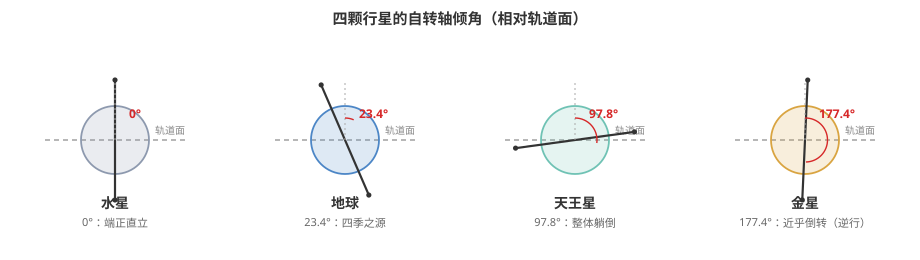

# 行星的奇妙"转向"：南北极、不变平面与那些"躺倒"的行星

宇宙的浩瀚与行星的多样性总是令人着迷。本文探讨行星的南北极和转轴倾角这两个基本概念及其引人深思的特性。

## 严谨定义星球的南北极：基于自转与惯性坐标系

在讨论行星的南北极时，尤其在地理意义上，存在两种主要的定义方式：

1. **基于自转方向（右手定则）：** 这是一种动力学定义。假想用右手握住行星，使四指弯曲的方向与行星自转的方向一致，那么大拇指所指的方向被定义为地理北极。地理南极则位于自转轴的另一端。对于太阳系的大多数行星（包括地球），从地理北极上方观察，其自转方向为逆时针。

2. **基于太阳系不变平面：** 这是一种基于惯性坐标系的定义。**太阳系的不变平面**是指垂直于太阳系总轨道角动量矢量的平面，该平面通过太阳系的质心。其北极方向被定义为**太阳系不变平面的北极**。行星的自转方向可以通过比较其地理北极与太阳系不变平面的北极方向来判断。如果两者大致指向同一方向，则行星的自转是**顺行**的；如果指向相反方向，则为**逆行**。

在后续讨论中，除非特别指明，我们所指的南北极是**基于自转方向（右手定则）定义的地理南北极**。在讨论金星和天王星的自转特性时，我们会明确指出所使用的定义。

## 太阳系的不变平面：宇宙的角动量基准

**太阳系的不变平面**由太阳系内所有天体的轨道角动量矢量之和 L_total 决定：

$$\mathbf{L}_\text{total} = \sum_{i} m_i (\mathbf{r}_i \times \mathbf{v}_i)$$

其中，mᵢ 是第 i 个天体的质量，rᵢ 是其相对于太阳系质心的位矢，vᵢ 是其相对于太阳系质心的速度矢量。由于太阳和几颗大行星（特别是木星）占据了太阳系绝大部分的质量和角动量，因此不变平面与这些天体的轨道平面密切相关。不变平面为研究太阳系动力学提供了一个重要的参考框架。

## 转轴倾角：行星自转轴的倾斜度

行星的**转轴倾角** ε 是指行星的自转轴 ω 与其公转轨道平面的法线 n 之间的夹角，可以通过以下公式计算：

$$\cos(\epsilon) = \frac{\mathbf{\omega} \cdot \mathbf{n}}{\|\mathbf{\omega}\| \cdot \|\mathbf{n}\|}$$

其中，ω·n 是自转轴矢量和轨道平面法线矢量的点积，‖ω‖ 和 ‖n‖ 分别是它们的模长。转轴倾角的精确数值需要通过对行星的长期观测和数据分析获得。

## 金星与天王星：极端转轴倾角的案例分析

上图中自转轴偏离竖直虚线的角度就是转轴倾角：水星端端正正，地球斜了 23.4°（四季的来源），天王星几乎"躺"在轨道面上，金星则接近倒转——按右手定则它的 N 极指向了与其他行星相反的一侧。

金星和天王星的转轴倾角在太阳系中表现出异常的特征，理解这些特征需要结合不同的南北极定义进行分析：

- **金星：** 其转轴倾角约为 177.36°。
    - **基于右手定则的地理南北极：** 仍然适用，定义了金星的自转轴。
    - **基于太阳系不变平面的北极：** 由于其转轴倾角接近 180 度，金星的地理北极指向与太阳系不变平面的北极方向几乎相反。因此，从这个角度来看，金星被认为是**逆行自转**的。这导致了从地球上观测到的金星自转方向是顺时针的。值得注意的是，虽然被称为逆行自转，但其地理南北极仍然按照右手定则定义。
    - **季节变化：** 如此小的正向倾斜（或接近 180 度的倾斜）导致金星上几乎没有明显的季节变化。

- **天王星：** 它的转轴倾角约为 97.77°。
    - **基于右手定则的地理南北极：** 仍然适用，定义了天王星的自转轴。
    - **基于太阳系不变平面的北极：** 天王星的转轴倾角超过 90 度，这意味着其自转轴几乎躺在其轨道平面上。按照太阳系不变平面的定义，天王星也属于逆行自转的范畴。
    - **季节变化：** 天王星的极端倾斜导致其南北极轮流指向太阳，造成了长达约 42 年的极昼和极夜现象。

## 天王星的地理南北极指向：一个随轨道变化的朝向

根据基于自转方向（右手定则）定义的地理南北极：

- 天王星的自转轴在空间中指向相对固定的方向，大致在黄道坐标系中的赤经约为 255 度，赤纬约为 +15 度附近（位于武仙座方向）。
- 然而，由于天王星的公转周期约为 84 年，其地理南北极相对于太阳的指向会发生显著变化。当其轨道运行到某个位置时，地理北极会大致指向太阳，而在半个轨道周期后，地理南极会指向太阳。

## 结论

理解行星的南北极需要区分基于自转方向和基于太阳系不变平面的定义。对于金星和天王星这两个特殊的行星，它们的极端转轴倾角和由此带来的独特自转特性，是行星科学中重要的研究课题，也体现了宇宙天体的多样性和复杂性。
