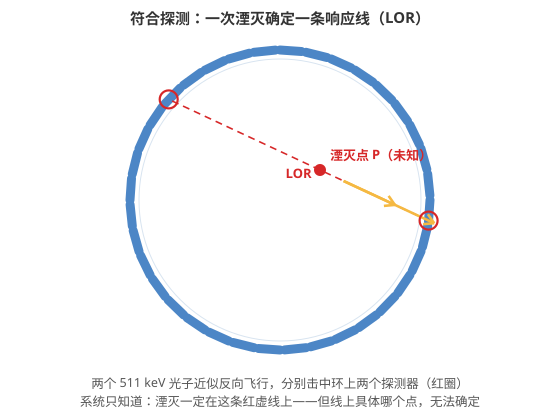
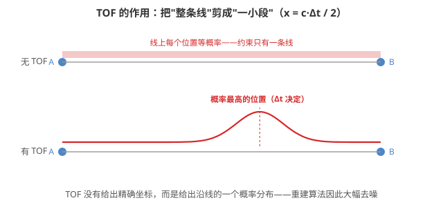

# 一颗正电子的旅程：PET 如何听见身体里的光

> 这是一篇科学故事。主角不是人，而是一颗正电子——以及一群试图"听见"它的探测器。故事里的每一步都有严格的物理依据，核心公式会在旅程中自然出现。

> **目录**
>
> - 序幕：一枚被精心设计的"信标"
> - 第一章：一颗正电子的短跑与刹车
> - 第二章：探测器听见的"回声"
> - 第三章：让噪声显形的几何学
> - 第四章：时间的剪刀——TOF
> - 终幕：四层定位的合奏

## 序幕：一枚被精心设计的"信标"

故事的起点，是一间加速器机房。在这里，氧-18 被质子轰击，变成了氟-18——一种不太稳定的原子核：它核内多了一个质子，急于把这个多余的质子"处理"掉。

处理方式就是 β⁺ 衰变：

$$p \rightarrow n + e^+ + \nu_e$$

质子转为中子，同时释放出一颗正电子 e⁺ 和一个中微子。这颗氟-18 随后被化学家接上葡萄糖骨架，制成 FDG（氟代脱氧葡萄糖）——身体里越活跃的细胞（比如肿瘤，比如大脑中正在思考的区域）越贪吃葡萄糖，于是它们主动把这些"信标"吞进体内。

注射完成。信标就位。故事正式开始。

## 第一章：一颗正电子的短跑与刹车

在某处高代谢的组织里，一个氟-18 核衰变了，我们的主角——一颗正电子——就此诞生。

但它并不是一出生就能"发光"的。刚诞生的它带着动能，像一颗子弹射进水里，一路上撞开沿途的原子（电离、激发），疯狂损失能量。这段"短跑"通常只有一毫米左右，但对后来的故事至关重要——因为**它停下脚步的位置，已经不是它出生的位置**。

当它减速到接近热运动的速度，终于与身旁一个电子相遇了。反粒子遇到正粒子，没有握手，只有一场彻底的能量兑换：

$$e^+ + e^- \rightarrow \gamma + \gamma$$

两颗静质量各自对应 511 keV 的粒子，把 2mₑc² ≈ 1022 keV 的总能量全部兑换成两个 γ 光子，向相反方向飞去。

这里有一个值得停下来的细节：**为什么恰好是两个光子？** 假如只产生一个光子，动量守恒就无从谈起——初始系统近似静止（总动量为零），而单个光子只要携带能量就必然携带动量。两个光子背靠背、动量严格相消，能量账和动量账才能同时结清。

于是物理学给出了 PET 的第一块基石：

> 每一次湮灭，都会向相反方向发出两个约 511 keV 的光子。

## 第二章：探测器听见的"回声"

扫描仪并没有看见那场湮灭。它只知道：环带上某两个探测器，几乎同时被击中了。

"几乎同时"——这个时间窗口通常只有几纳秒。当两个探测器在窗口内先后报信，系统认定它们大概率来自同一次湮灭，于是把这两个探测器的连线记了下来。这条线有一个正式的名字：**响应线（Line of Response，LOR）**。

一次符合事件给出的信息是：

> 湮灭一定发生在这条线上。

注意，仅仅是"在这条线上"。线上成千上万个点，每一个都可能是案发地——A 与 B 之间的 P₁、P₂、P₃，系统一概无法区分。**普通 PET 得到的是一条直线，而不是一个坐标。**

而且这里还埋着两处天然的不完美：

1. **正电子射程**：探测器定位的是湮灭点，而信标（衰变核）在另一处——两者之间差着那段"短跑"的距离。
2. **非共线性**：湮灭瞬间粒子对并非严格静止，残余动量让两个光子的夹角偏离 180° 一点点。

这两条都是物理规律本身划下的分辨率上限，与探测器造得多精密无关。

此外，并非每一次"符合"都值得相信：有的光子在体内被散射拐了弯（散射事件），让 LOR 指向错误的方向；有的两颗光子来自毫不相干的两次湮灭，只是碰巧进了同一个时间窗（随机事件），凭空捏造出一条假线。真正的重建必须把这些杂质逐一校正掉。

## 第三章：让噪声显形的几何学

单个事件几乎不携带信息，但千万个事件叠加起来，图景开始浮现。

想象体内某个位置代谢格外旺盛——那里吞下了更多的 FDG，于是那里反复发生湮灭。每一个湮灭都贡献一条 LOR，而来自同一区域的 LOR 会在空间中密集地穿过同一个点。就像无数条铅笔线交叉描摹，最黑的地方，就是线条最密集交汇的地方。

从数学上看，这与 CT 是同一类问题：CT 测量 X 射线沿每条路径的衰减积分，其表达式为：

$$I = I_0 e^{-\int \mu\, ds}$$

PET 则统计每条 LOR 上发生过的湮灭。两者都是在收集大量投影，反演出体内的三维分布——一个经典的逆问题。

现代重建算法（MLEM、OSEM 等）的做法可以概括成一句话：

> 猜一个三维放射性分布，让"这个分布预测出的探测数据"与"实际记录的数据"尽可能吻合，然后不断修正这个猜测。

用统计语言说，每个探测器读数 yᵢ 服从泊松分布：

$$y_i \sim \mathrm{Poisson}\left(\sum_j A_{ij} x_j + r_i + s_i\right)$$

其中 xⱼ 是第 j 个体素的放射性，Aᵢⱼ 是体素对测量的贡献，rᵢ 与 sᵢ 分别是随机与散射本底。迭代求解，最终得到 f(x,y,z)——那幅 PET 图像。

**所以 PET 图像从来不是"拍"出来的，而是从统计中"反演"出来的。**

## 第四章：时间的剪刀——TOF

至此，故事里的探测器只知道"线"，不知道"点"。传统 PET 就这样工作了几十年。

但两个光子的飞行时间藏着一个被忽略已久的秘密。设湮灭点偏离 LOR 中点 x：靠近 A 的光子少飞一段，靠近 B 的光子多飞一段，路程差恰好是 2x。于是：

$$x = \frac{c\,\Delta t}{2}$$

只要测出两个光子到达的时间差 Δt，就能估计湮灭点在线上的位置。1 纳秒的时间差对应 15 厘米的偏移。

可惜现实中的探测器分辨不了 1 纳秒。400 ps 级的时间分辨率对应约 6 厘米的空间不确定度——所以 TOF 并没有把 LOR 变成一个点，而是把它变成了一小段：

> 没有 TOF：整条线上的位置等概率。
> 有了 TOF：可能性集中在线上某一小段内，呈概率分布 P(x | Δt)。

对重建算法而言，这是质变：每条线携带的定位信息从"一维的整条"收窄为"一小段高概率区"，噪声在数学上被大幅抑制，图像信噪比显著提升——胖一点的患者受益尤其明显。

**TOF 没有发明新的几何，它只是给旧的 LOR 剪了一刀。**

## 终幕：四层定位的合奏

现在可以回答标题的问题了：PET 如何听见身体里的光？答案是分层完成的：

| 层次 | 物理机制 | 提供的信息 |
|---|---|---|
| ① 湮灭物理 | e⁺ + e⁻ → 2γ | 两个反向的 511 keV 光子 |
| ② 探测器几何 | 符合探测 A ↔ B | 一条 LOR（一维约束） |
| ③ 飞行时间 | x = c·Δt/2 | 沿线的位置概率 |
| ④ 统计重建 | 泊松模型 + 迭代反演 | 三维分布 f(x,y,z) |

PET 自己回答"代谢有多活跃"，CT 回答"解剖结构在哪里"——PET/CT 把两套物理信息融进同一个坐标系，一个病灶于是同时开口回答两个问题。

最后，把整个故事压缩成三个公式：

$$2m_ec^2 = 2 \times 511\ \text{keV} \qquad \vec p_1 + \vec p_2 \approx 0 \qquad x = \frac{c\,\Delta t}{2}$$

能量守恒给了两个光子，动量守恒给了那条线，时间差给了线上的位置。三句话连起来，就是这颗正电子从衰变到图像的完整旅程。
