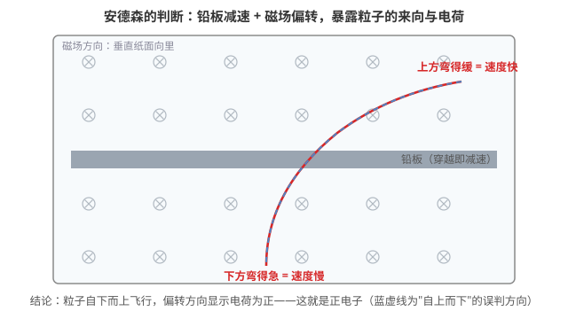
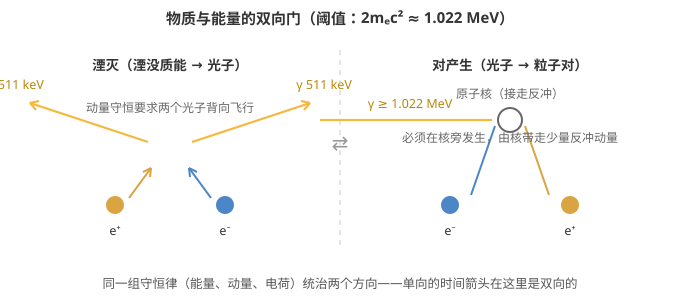

# 电子与正电子：一枚粒子和它的镜像

> 这篇文章回答四个问题：啥是电子？啥是正电子？正电子是怎么被发现的？它俩什么关系？以及——为啥自然界里几乎看不到正电子？本文是《[[一颗正电子的旅程：PET如何听见身体里的光]]》的前传。

## 一、电子：人类认识的第一个基本粒子

电子（electron）是带一个单位负电荷、静质量约为 9.109×10⁻³¹ kg 的基本粒子——这是质子质量的约 1/1836，小到可以忽略不计却主宰了整个化学世界。

1897 年，J. J. 汤姆孙在阴极射线管中测出了这种"射线"的荷质比，发现它不管用什么材料的阴极、充什么气体，数值都一样——说明它是所有物质共有的成分。人类第一次知道：原子不是不可分割的，里面有更小的粒子。

电子的几个关键事实：

- **电荷**：−1 个基本电荷（−1.602×10⁻¹⁹ C）
- **自旋**：1/2，是费米子
- **稳定性**：目前没有任何证据表明自由电子会衰变，它是已知最稳定的粒子之一
- **角色**：原子的壳层、化学键、电流、光——你眼前的一切，几乎都是电子的行为

## 二、正电子：先被"算"出来，再被"看"到

正电子（positron）是电子的反粒子：**质量、自旋、寿命与电子完全相同，电荷等量异号（+1），其他内部量子数也全部相反。**

它的诞生分两步：先出现在纸上，再出现在云室里。

**第一步：狄拉克的方程（1928）。** 狄拉克把量子力学和狭义相对论结合起来，写出描述电子的波动方程。这个方程解出来有个奇怪的麻烦：除了描述电子的解，方程还允许一组"负能量"的解——可谁也没见过负能量的电子。1931 年，狄拉克认真对待这个数学预言，提出：方程要求存在一种与电子质量相同、电荷为 +1 的未知粒子。他当时甚至不敢直接说"这是电子的镜像"，只谨慎地称之为"另一种粒子"。

**第二步：安德森的云室（1932）。** 卡尔·安德森在研究宇宙射线时，让粒子穿过云室中的铅板。粒子在磁场中拐弯，轨迹的弯曲方向暴露了电荷的符号；铅板则让它减速——**比较铅板两侧轨迹的弯曲程度，就能判断粒子是往上飞还是往下飞**。结论与当时的预期不同：这种粒子的质量与电子相当，电荷却是正的。1933 年，他确认这就是狄拉克预言的粒子。正电子成了人类发现的第一个反物质粒子，安德森因此获得 1936 年诺贝尔物理学奖。

这个发现有一个细节：这不是"造"出来的粒子，宇宙射线一直在撞大气，正电子本来就在那里，等待的是能读懂轨迹的观测。

## 三、电子与正电子：镜像关系的严格含义

"反粒子"不是科幻概念，它是一组严格的对应：

| 属性 | 电子 e⁻ | 正电子 e⁺ |
|---|---|---|
| 静质量 | 9.109×10⁻³¹ kg | 完全相同 |
| 电荷 | −1 | +1 |
| 自旋 | 1/2 | 1/2（自旋方向规则相反） |
| 轻子数 | +1 | −1 |
| 寿命 | 稳定 | 稳定（孤立状态下） |

镜像关系最直接的体现是**两者相遇时的湮灭**：正负电子对的整体质量转化为电磁辐射——

$$e^+ + e^- \rightarrow \gamma + \gamma$$

在两者近似静止时，产生的两个光子各带 511 keV 能量、背向飞行。反过来，能量高于 1.022 MeV（即 2mₑc²）的 γ 光子在原子核附近也能凭空"变出"一对正负电子（**对产生**）。物质与能量的这道双向门，相对论和量子力学缺一不可。

还有一个常被忽略的事实：**湮灭不等于"什么都没有了"**。电荷守恒、动量守恒、能量守恒在湮灭前后始终成立——湮灭是"粒子形式"的终结，不是物理量的终结。正负电子对的总电荷为零，两个光子一个带正螺旋性、一个带负螺旋性，总账依然清清爽爽。

## 四、为什么自然界里很少见到正电子？

四个原因，按重要性排序：

**1. 湮灭太快了。** 正电子一进入由电子构成的物质，就会在遇到电子后湮灭，通常撑不到 1 纳秒的量级（取决于能量，从皮秒到几百纳秒不等）。我们的世界是"电子的世界"，正电子在这里没有立足之地。

**2. 制造它的门槛高。** 对产生需要 ≥ 1.022 MeV 的光子——这远高于几乎所有天然放射性和日常电磁辐射的能量。日常环境里没有这个条件。

**3. 它的天然来源都不稳定。** 自然界正电子的唯一稳定来源是 β⁺ 衰变，而能发生 β⁺ 衰变的核素（如氟-18、碳-11）寿命都很短（分钟级），地球形成时的库存早已用尽。现存极少量来自宇宙射线撞击高层大气，以及钾-40 等天然放射性核素的罕见衰变分支——所以你的身体里其实时刻都在产生正电子，只是每颗活不到一眨眼。

**4. 宇宙尺度上的不对称是个未解之谜。** 大爆炸本应产生等量的物质与反物质，它们本该互相湮灭殆尽，但今天的宇宙几乎只剩物质。这个"正反物质不对称"（CP 破坏不足以完全解释它）是现代物理学的头号悬案之一。我们能在自然界看到电子满地都是、正电子凤毛麟角，本身就是这个悬案的日常注脚。

## 五、彩蛋：《EVA》为什么用"阳电子炮"

《新世纪福音战士》第 6 话里，初号机狙击雷米尔用的是"阳电子炮"（Positron Rifle，阳电子即正电子的旧译）。这个武器的原理可以直接由物理说明：

1. **弹药自带湮灭逻辑**。正电子束打中由普通物质构成的目标时，会与目标中的电子立刻成对湮灭，每一对都释放 2×511 keV ≈ 1.022 MeV 的能量。也就是说，**武器的一部分破坏能量是从目标自身"借"来的**——目标越致密（比如使徒的 A.T. 力场与本体），可供湮灭的电子越多，能量释放越充分。这是任何常规动能武器做不到的。

2. **朝天空开炮时不留弹道隐患**。常规实弹打上天空总会落下来；正电子束若未击中目标，进入大气后很快与空气中的电子湮灭殆尽，化作两个 511 keV 的光子脉冲耗散掉。

3. **反物质武器的真实代价**。剧中狙击需要的电量是全日本之水准（剧情设定）。这一点与上一节的事实相符：自然界正电子稀少，人工产生正电子需要高能加速器或强放射源，效率极低。反物质被认为是"终极燃料"——每千克湮灭释放的能量约为氢弹化学当量的百亿倍，但制造成本也是天文数字，目前全球人工制造的反物质总量连烧开一壶水都不够。

所以"阳电子炮"的设定把狄拉克方程的产物、湮灭的能量账、以及反物质的稀缺性，一并装进了狙击枪管里。

## 六、小结

- **电子**：负电荷、极轻、极稳定，物质世界的"主角粒子"。
- **正电子**：电子的完整镜像，先由狄拉克方程预言（1931）、再被安德森在宇宙射线中证实（1932）——人类第一个反物质粒子。
- **关系**：等质量、反电荷，相遇即湮灭成 511 keV 光子对，高能光子也能反向造出正负电子对。
- **自然界稀少**：因为它在电子世界里活不长，制造门槛高，天然来源稀少——以及一个更深的谜：宇宙为什么本来就偏袒物质。
