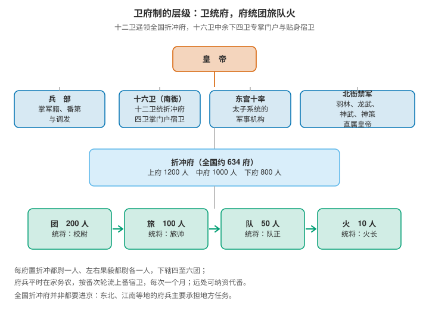
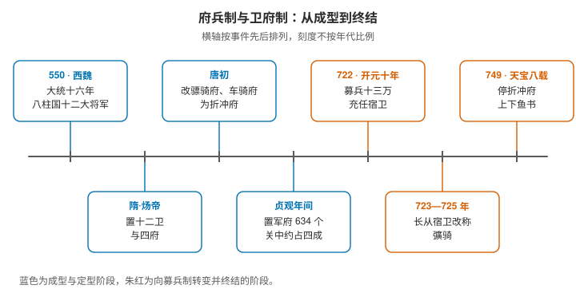

# 唐代卫府制：十六卫、折冲府与府兵的轮值

> 唐代前期的军事体系叫**卫府制**：中央设十六卫，全国设六百多个折冲府，卫领导府，府提供兵。所以"一个卫有多少兵"这个问题本身就需要修正——卫握的不是兵员，是覆盖全国的指挥链；兵平时在各地种地，轮到番次才进京宿卫。
>
> 这套制度在唐玄宗手里终结：开元年间改用募兵，天宝八载（749）停发征调府兵的鱼书，府兵制在法律上结束。

> **目录**
>
> - 一、卫府制的两层：卫是领导机构，府是基层组织
> - 二、十六卫：十二卫统兵，四卫守门
> - 三、一个卫有多少兵：问题本身需要修正
> - 四、折冲府：上中下三等的编制
> - 五、番上：府兵的轮值方式
> - 六、府兵是什么人
> - 七、兵力为什么压在关中
> - 八、南衙与北衙：两支军队，两条政治线
> - 九、尚未解决的问题

## 一、卫府制的两层：卫是领导机构，府是基层组织

"卫府制"这个名字就是它的结构：

| 层级 | 位置 | 作用 |
|---|---|---|
| **卫** | 中央 | 领导机构，掌宿卫京师，**遥领**全国折冲府 |
| **府**（折冲府） | 地方 | 府兵的基本组织单位，平时管军籍与农事，战时执行征防 |

这套体制把两件事合成了一件：**禁兵与府兵被并入同一个系统**。十六卫既是府兵领导机构，也承担宫禁宿卫，"居中御外，卫戍京师"。

**关键在"遥领"二字。** 卫并不在京城养着几万兵，它领的是分布在全国的折冲府；府兵平时在家务农，轮到番次才上京值班。所以这套制度的重心不在兵营，而在**军籍与番次的调度**。

## 二、十六卫：十二卫统兵，四卫守门

十六卫由八组构成，每组左右对称：

| 卫 | 主要职能 |
|---|---|
| 左右卫 | 最核心。下辖亲、勋、翊五府（内府），此外统领外府 |
| 左右骁卫 | 宿卫 |
| 左右武卫 | 宿卫 |
| 左右威卫 | 宿卫 |
| 左右领军卫 | 宿卫 |
| 左右金吾卫 | **掌宫中与京城巡警**——宵禁、街鼓即归其管辖 |
| 左右监门卫 | **掌门籍与宫门守卫** |
| 左右千牛卫 | **掌御刀宿卫侍从**，是皇帝身边最近的一层 |

**前六组共十二卫，是府兵的领导机构**，分领全国折冲府；**后两组共四卫不统府兵**，专管门户与贴身宿卫。分工的逻辑很清楚：统兵的不管门，管门的不统兵。

各卫长官是**大将军一人（正三品）**、**将军二人（从三品）**。把品级放回上一篇的框架里看就明白了——正三品正是实职的天花板，也就是说，十六卫大将军与三省长官、六部尚书处在同一格。

另外还有**东宫十率**，是太子系统的军事机构；全国的折冲府则分别隶属于十二卫与东宫六率。贞元二年（786）又增设了十六卫上将军。

顺带一个与改名有关的呼应：武则天光宅元年（684）那一轮改名中，左右骁卫改为**左右武威**、左右武卫改为**左右鹰扬卫**、左右威卫改为**左右豹韬卫**、左右领军卫改为**左右玉钤卫**。同一批军队，在一份诏书里换了四个名字。

## 三、一个卫有多少兵：问题本身需要修正

**卫不是一个常备兵团，它没有固定的兵员数字。** 卫的"编制"是军官与机构，兵力来自它所遥领的折冲府。因此等价的问法是：**一个卫领多少个府？**

十二卫分领全国六百余府，平均每卫五六十府。如果按中府一千人粗算，**一个卫对应的府兵约在五六万之间**——但这个数字需要立刻注明两点：

- 这是**推算**，不是史籍里的编制数；
- 这五六万人**平时散在全国各地种地**，只有轮到番次的那一部分才进京。卫在某一时刻真正能指挥的，是当时正在上番的那一批。

所以十六卫的实力不在常备兵数，而在于它**覆盖全国的指挥链**与**对军籍、番次的统一调度**。这也是为什么府兵制一旦失去兵源，整座大厦会跟着塌——卫本身没有属于自己的兵。

## 四、折冲府：上中下三等的编制



折冲府是府兵的基本组织单位，**独立于地方州县之外，是专门的军事区域**。"折冲"意为克敌制胜。按规模分三等：

| 等级 | 兵额 |
|---|---|
| 上府 | 1200 人（有时增至 1500） |
| 中府 | 1000 人 |
| 下府 | 800 人 |

每府设**折冲都尉一人**、**左右果毅都尉各一人**，另有长史、兵曹、别将各一人，**下辖四至六团**。府内的层级是四级：

```text
团（200 人，校尉）→ 旅（100 人，旅帅）→ 队（50 人，队正）→ 火（10 人，火长）
```

**数量与总量**：贞观年间全国置军府**约 634 个**（另有 657 府的说法，可考者为 627 府，差别来自统计口径）。按三等兵额推算，**府兵总额约 60 万人**（按上限推算则有 80 万之说）。

## 五、番上：府兵的轮值方式

府兵按**番次**轮流到京师宿卫或到指定地点执勤，这套轮值叫**番上**。番第由**兵部**根据军府距离京师的远近来定，每次上番一般**一个月**。

具体标准各书记载不一，两说并列：

| 依据 | 距京师里程 | 番次 |
|---|---|---|
| 《唐六典》 | 百里外、五百里外、一千里外、二千里外 | 五番、七番、八番、九番（二千里外每次两个月） |
| 另一说 | 五百里内、千里内、一千五百里内、二千里内、二千里外 | 五番、七番、八番、十番、十二番，皆一月上 |

后一种说法流传更广，大意是**距离越远、轮值频率越低**——因为往返本身就要耗掉大量时间与路费。为照顾远地府兵，唐代允许**纳资代番**，即缴纳财物代替服役。

**番上之外还有番役**，指地方的轮值任务；此外工匠与文武散官也要定期番上。而现代研究依据吐鲁番文书作了一处重要修正：**全国折冲府并非都要进京宿卫**——东北、江南等地的府兵主要承担地方任务。也就是说，长安城里的上番宿卫主要由距离较近、特别是关中一带的军府承担。

## 六、府兵是什么人

**府兵是均田制下的义务兵，不是职业军人。**

- **兵农合一**：平时在家务农，户籍由军府管理，战时奉调出征；
- **自备装备**：兵器与部分粮草由府兵自备，武器有马槊、横刀等；
- **以土地换兵役**：家中分得土地，本人承担兵役义务。

这套设计的成本优势很明显：**国家不需要常备军费**。而它的脆弱之处也在这里——**一切以均田制能维持为前提**。土地兼并一旦加剧，府兵既失去经济基础，也无力自备装备；再加上边地战事长期化，一年一个月的番上根本无法应付连年出征。兵源、装备、任期三条同时出问题，府兵制的解体就不可避免。

## 七、兵力为什么压在关中

折冲府的分布极不均衡。据可考 627 府统计：

| 道 | 折冲府数 | 占比 |
|---|---|---|
| 关内道 | 约 288 | 约 44% |
| 河东道 | 约 164 | 约 25% |
| 其余诸道 | 约 175 | 约 28% |

关内道是首都所在，河东道是李唐起家的地方，两者合计约七成。这个布局有明确的用意，唐人自己的表述是：

```text
居重驭轻（《陆宣公奏议》）
举关中之众以临四方（《玉海·兵制》）
```

**中央对地方保持压倒性的兵力优势，就是府兵制布局的第一原则。** 而这个优势并不永久：边防长期用兵之后，边镇的兵力持续膨胀，中央与地方的力量对比随之反转，这正是后来藩镇格局的起点之一。

## 八、南衙与北衙：两支军队，两条政治线



唐代皇宫的禁卫分两支：

- **南衙**：即十六卫，属于宰相系统，军籍、番第与调发由兵部掌管；
- **北衙**：皇帝直属的禁军，与宰相系统无关。

北衙的源流是一点点长起来的：

| 时间 | 变化 |
|---|---|
| 贞观十二年（638） | 太宗设玄武门左右屯营 |
| 高宗时 | 改称**羽林军** |
| 太宗选善射者百人 | **百骑** → 千骑 → 万骑 → **左右龙武军** |
| 此后 | **神武军**、**神策军**相继出现 |

**南衙与北衙的消长，是唐代政治史的一条主线。** 府兵制健全时，南衙有实兵；府兵瓦解后，北衙成为唯一可靠的武力，安史之乱以后尤其以**神策军**最重，而神策军后来由宦官执掌——兵权与相权的天平就此倾斜。

**府兵制的终结过程**时间点很清楚：

| 时间 | 事件 |
|---|---|
| 西魏大统十六年（550） | 府兵制成型（八柱国、十二大将军） |
| 隋 | 置十二卫与四府 |
| 唐初 | 改骠骑府、车骑府为折冲府 |
| 贞观年间 | 置军府 634 个，关中约占四成 |
| 开元十年（722） | 张说建议募兵，募十三万充任宿卫 |
| 开元十一至十三年（723—725） | 长从宿卫，后改称**彍骑** |
| **天宝八载（749）** | **停折冲府上下鱼书**——府兵制在法律上终结 |

最后一步最值得记住：**所谓"停折冲府上下鱼书"，就是不再向折冲府下发征调府兵的鱼符与敕书。** 一道命令停下，整套运转了两百年的兵役体系就正式关停了。

取代它的是募兵制。两者最根本的差别不在兵源，而在**士兵与国家的连接方式**：府兵通过土地与户籍同国家相连，募兵则通过军饷与直接统属相连。士兵一旦不再有土地可回，"兵"就成了一种职业——这既是战斗力的来源，也是藩镇格局的起点。

## 九、尚未解决的问题

- [[唐长安城常驻宿卫兵力的实际规模，以及十六卫在宿卫班次中的具体配比]]
- [[折冲府在十二卫与东宫六率之间的分配方式，以及各卫所领府数的可考清单]]
- [[彍骑的制度细节，以及它在开元后期迅速废弛的原因]]
