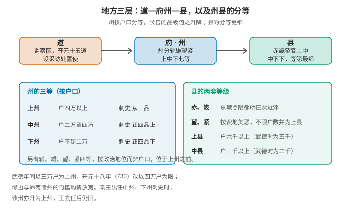
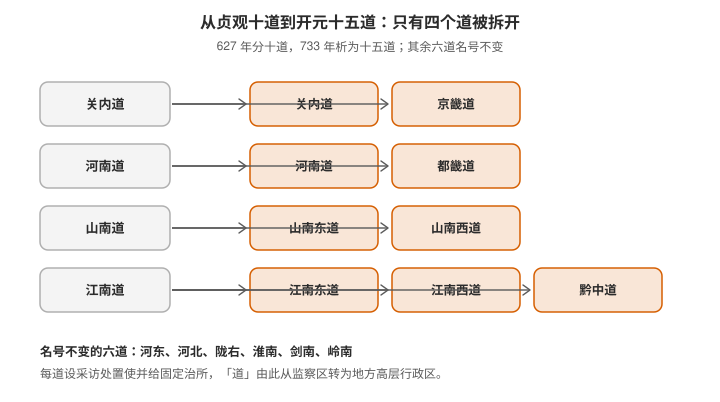
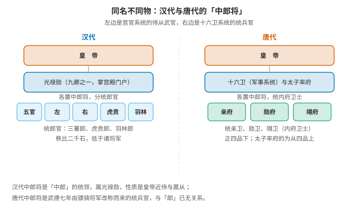

# 唐代的州县制度：上中下州、十道，以及中郎将的汉唐之别

> 唐代的地方行政区划是一个三层结构：道、州、县。州是核心那一级——全国三百余州，按户口与政治地位分成七个等级，等级直接决定刺史的品级，也决定一个官是被重用还是被贬谪。
>
> 而"中郎将"这个官名在汉代与唐代指的是两种东西：汉代它是光禄勋属下郎官的统领，唐代它是十六卫里统领内府卫士的统兵官，武德七年才由骠骑将军改称而来。

> **目录**
>
> - 一、三层结构：道、州、县
> - 二、州有多少个
> - 三、州分七等：辅雄望紧与上中下
> - 四、县的等级比州更细
> - 五、贞观十道与开元十五道
> - 六、十道与今天的地理对照
> - 七、府、都护府与节度使：另外几套区划
> - 八、中郎将：汉代与唐代是两个东西
> - 九、尚未解决的问题

## 一、三层结构：道、州、县

唐初的地方框架是**都督府—州—县**的实三级制，都督府统辖若干州；后来演变为**道—州—县**的格局，其中"道"起初只是监察区，到开元年间才获得正式治所与行政地位。

三层之中，**州是最关键的一级**：它既是中央与基层之间的中继，也是官员仕途上的主要台阶。这一篇的重点就落在州与县的分等上。

## 二、州有多少个

《旧唐书·地理志》留下了两组数字：

| 时间 | 州府 | 县 |
|---|---|---|
| 贞观十三年（639） | 358 | 1551 |
| 开元二十八年（740） | 328 | 1573 |

州数在九十年里略有减少，县数反而增加——因为此间有过并省与析置，州的合并多于新设。

需要说明的是，**"唐代有多少个州"并没有唯一答案**，因为不同的统计口径会得出不同结果：

- 有的统计把**都督府**算在内，数目偏大（如"贞观十四年三百六十州"）；
- 有的把**羁縻府州**计入——那是设在少数民族地区、长官世袭、名义上隶属中央的建制，数量庞大，与正州的管理方式完全不同；
- 开元、天宝之间各年的并省也在变动。

所以更稳妥的表述是：**正州在三百三十至三百六十之间浮动**，视年代与口径而定。

## 三、州分七等：辅雄望紧与上中下

州不是一个统一的等级，而是**辅、雄、望、紧、上、中、下七等**。其中：

- **辅、雄、望、紧**四等按政治地位确定，排在上州之前（京兆府、河南府、太原府一类属于最高一等）；
- **上、中、下**三等按**户口**确定，是适用范围最广、最具普遍意义的划分。

《唐六典》记下的户口标准与长官品级对照如下：

| 等级 | 户口 | 刺史品级 |
|---|---|---|
| 上州 | 户四万以上 | 从三品 |
| 中州 | 户二万至四万 | 正四品上 |
| 下州 | 户不足二万 | 正四品下 |

三条值得留意的细节：

- **标准本身在变**。武德年间以三万户为上州，开元十八年（730）才改为四万户——门槛提高，是因为户口总数增长了。
- **门槛有弹性**。缘边州三万户以上即可为上州、二万户以上为中州；岭南诸州三万户以上即可列为上州。
- **有一条特殊规则**：亲王出任中州、下州刺史时，该州也随之升为上州，王去任后恢复原等。州等并非纯粹的人口统计，它同时是政治待遇。

州等的实际后果落在官员身上：**上州刺史多由中书门下五品以上官出任，被视为重要的晋升阶梯；下州刺史则常作为贬谪之职**。柳宗元贬为柳州刺史，就是后一种情形——而按照前面提过的品级表，下州刺史正是正四品下。

## 四、县的等级比州更细

县的等第分得更细，大致是**赤、畿、望、紧、上、中、中下、下**。前两类与户口无关，看的是政治位置：

- **赤县**：京城与陪都所在的县；
- **畿县**：京城近郊的县；
- **望、紧**：按"资地美恶"评定，**不限户数，一律按上县对待**。

其余按户口分等，标准同样在武德与开元之间调整过：

| 依据 | 上县 | 中县 | 中下县 |
|---|---|---|---|
| 武德令 | 户五千以上 | 户二千以上 | 户一千以上 |
| 开元十八年 | 户六千以上 | 户三千以上 | 不满三千户 |

**所以"某县令"是几品官，必须先问这个县是几等县。** 这与州的情形是同一个逻辑：唐代地方官的品级不写在官职名称里，而是由所在地的等级决定。

## 五、贞观十道与开元十五道

**贞观元年（627），天下分为十道**：关内、河南、河东、河北、山南、陇右、淮南、江南、剑南、岭南。这些"道"起初是**监察区**，道名本身不是行政层级。

**开元二十一年（733）析为十五道**，方式是拆开其中四个：

| 原道 | 拆分为 |
|---|---|
| 关内道 | 关内道 + **京畿道**（长安附近） |
| 河南道 | 河南道 + **都畿道**（洛阳附近） |
| 山南道 | **山南东道 + 山南西道** |
| 江南道 | **江南东道 + 江南西道 + 黔中道** |

其余六道名号不变：河东、河北、陇右、淮南、剑南、岭南。

**关键的变化在官制**：十五道各设**采访处置使**并给予固定治所，道于是从监察区转变为**地方高层行政区**。这已经是"道—州—县"的实体化，而它再往前走一步，就是节度使辖区取代道的位置。

顺带一个活的遗存：**"道"这个行政区名至今还在东亚使用**——朝鲜的咸镜北道、黄海南道，韩国的江原道、京畿道，以及日本的北海道。

## 六、十道与今天的地理对照

下表给的是**大致对应**，因为古今边界并不重合，各道的辖境也随时代伸缩：

| 道 | 大致范围 | 今天大致对应 |
|---|---|---|
| 关内道 | 关中、陕北、河套一带 | 陕西中北部、甘肃东部、宁夏、内蒙古河套地区 |
| 河南道 | 黄河中下游的平原区 | 河南大部、山东大部，兼及安徽、江苏北部 |
| 河东道 | 山西高原 | 山西全省 |
| 河北道 | 华北平原北部 | 河北、北京、天津，兼及辽宁西部、河南北部 |
| 山南道 | 秦岭以南、长江以北 | 陕西南部、湖北西部、四川东北部 |
| 陇右道 | 陇山以西 | 甘肃、青海东北部，兼及新疆东部 |
| 淮南道 | 江淮之间 | 安徽中部、江苏中部 |
| 江南道 | 长江中下游以南 | 江苏南部、浙江、福建、江西、湖南、贵州 |
| 剑南道 | 四川盆地 | 四川大部、云南北部 |
| 岭南道 | 五岭以南 | 广东、广西、海南，兼及越南北部 |

从这张表能看出一件事：**唐代的"道"基本是按自然地理边界划的**——河东道对应山西高原、剑南道对应四川盆地、岭南道对应五岭以南，都是地形单元而非任意切分。这也是为什么这些名称在两千年后仍然容易辨认。

## 七、府、都护府与节度使：另外几套区划

州县的体系之外，"唐代行政区划"还叠着四类特殊建制，读史时容易与州混淆：

| 建制 | 性质 | 例子 |
|---|---|---|
| 府 | 首都、陪都与龙兴之地所在，地位高于州，长官称尹 | 京兆府、河南府、太原府 |
| 都护府 | 边疆地区的最高管理机构 | 安西、北庭、安东、安南、单于、安北六都护府 |
| 节度使辖区 | 军事防区，天宝年间有十节度 | 安西、河西、范阳、平卢等 |
| 羁縻府州 | 少数民族地区，长官世袭、名义隶属 | 分布于边疆各道 |

这四类各有各的治理逻辑：府是提升京畿的等级，都护府与节度使是边疆的军政管理，羁縻府州则是"名义隶属、内部自治"的折中。**唐代的疆域不能只按州县来计算**，这也是"州数"难以给出单一数字的原因。

## 八、中郎将：汉代与唐代是两个东西

同一个官名，在两代属于完全不同的系统。

**汉代的中郎将，是"中郎"的统领。**

- 秦置中郎；西汉分**五官、左、右三中郎署**，各置中郎将统领皇帝的侍卫，**隶属光禄勋**——光禄勋是九卿之一，掌宫殿门户；
- 后来又增设**虎贲中郎将**（统虎贲郎）与**羽林中郎将**（统羽林军），后者与前者同级，**品秩比二千石，低于诸将军**；
- 郎的职责是**宿卫门户、执兵扈从**，所以中郎将的性质是**皇帝身边的侍从武官长**，名字与"郎"有实打实的关系。

**唐代的中郎将，是十六卫系统里的统兵官。**

- **武德七年（624），改骠骑将军为中郎将，车骑将军皆为郎将**——唐代的中郎将是由骠骑将军改称而来的，与"郎"已经没有任何词源关系；
- 岗位在**左右卫所属的亲府、勋府、翊府**（合称三府卫）：亲卫为一府，勋卫、翊卫为二府，**各置中郎将一人，品级正四品下**，统领校尉、旅帅与亲卫，执行宫廷宿卫并管理府内事务；
- **太子左右率府**下的亲府、勋府、翊府也各设中郎将一人，**从四品上**，其下另有左右郎将各一人，正五品下。

| | 汉代 | 唐代 |
|---|---|---|
| 隶属 | 光禄勋（九卿之一，宫官系统） | 十六卫与太子率府（军事系统） |
| 统领对象 | 郎官：三署郎、虎贲郎、羽林郎 | 亲卫、勋卫、翊卫（内府卫士） |
| 品秩 | 比二千石，低于诸将军 | 正四品下；率府者为从四品上 |
| 性质 | 皇帝近侍与扈从 | 宫廷宿卫的统兵实职 |
| 名称来源 | 郎官之长，名副其实 | 由骠骑将军改称，与"郎"无关 |

**一句话的差别**：汉代中郎将管的是"人"——皇帝的郎官班子；唐代中郎将管的是"府"——十六卫下属的内府卫士。两代都用这个名，但它所属的体系、统领的对象、对应的品级全变了。

## 九、尚未解决的问题

- [[唐代羁縻府州的数量与分布，以及它与正州在管理方式上的具体差异]]
- [[上中下州在各道的分布统计，能否与户口数据做出对照]]
- [[采访处置使、观察使与节度使三者的职能重叠与演变过程]]
