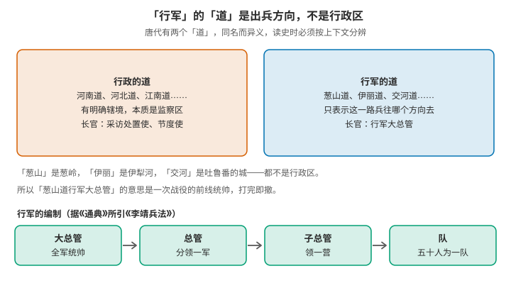
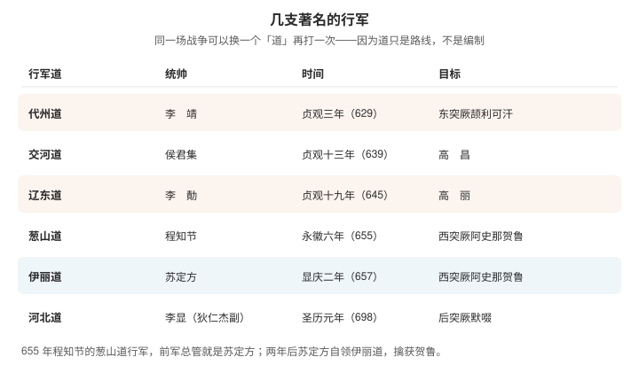
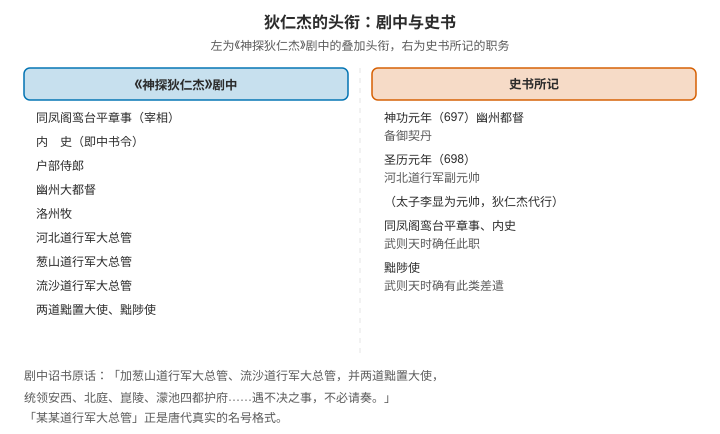

# 唐代的行军制度：行军大总管、"某某道"是什么，与狄仁杰的头衔

> "行军大总管"里的"行军"，**不是指部队开拔这个动作，而是一种军事建制的名称**——唐代遇有战事时临时编组的远征军团，战事一了便撤销。
>
> 而"葱山道""伊丽道"里的"道"，也**不是行政区划的道**，它只表示这一路兵往哪个方向去。理解了这两点，"某某道行军大总管"这个拗口的头衔就通了。

> **目录**
>
> - 一、"行军"是一种制度，不是动作
> - 二、两个"道"：行政的与行军的
> - 三、行军的编制：四级与七军
> - 四、兵从哪里来
> - 五、几支著名的行军
> - 六、从行军到节度使
> - 七、狄仁杰：史书里的那一次
> - 八、《神探狄仁杰》里武则天给他的头衔
> - 九、尚未解决的问题

## 一、"行军"是一种制度，不是动作

唐代的军事力量可以粗分两类：

- **镇军**：常驻在边疆与要地的部队，有固定驻地，负责防守；
- **行军**：为某一次战争临时编组的远征军团，**没有固定辖区，也没有常备兵**。

"行军"这一支的三个特征是连在一起的：

- **因事而设**——只为某一场战事组建；
- **事罢即撤**——战事结束，建制随之取消；
- **统帅临时任命**——带兵的权力是借来的，打完就要交还。

它与另外两个容易混的官职也不同：**都督**是常设的地方军政长官，**节度使**是常驻且辖区固定的军事长官，而**行军大总管只是一次战役的前线统帅**。

这套做法承自隋代（隋已有行军总管之制），唐初沿用并加以完善。它的好处是能迅速集中全国兵力打一场仗，且不至于让将帅长期握住兵权。

## 二、两个"道"：行政的与行军的



唐代有两个"道"，同名而异义，这是读唐代军事史料时最容易绊倒的一处：

| | 行政的道 | 行军的道 |
|---|---|---|
| 例子 | 河南道、河北道、江南道 | 葱山道、伊丽道、交河道 |
| 含义 | 监察区，后成行政区 | 这一路兵的出征方向 |
| 辖境 | 有明确范围 | 无所谓辖境，只指去向 |
| 长官 | 采访处置使、节度使 | 行军大总管 |

判断的办法很直接：**看"某某"是不是一个行政区的名字。** 葱山是葱岭，伊丽是伊犁河，交河是吐鲁番的交河城，定襄是今内蒙古和林格尔一带——**它们都是地名或地貌，不是行政区**。所以"葱山道行军大总管"的完整意思是：**从葱山这个方向出征的那支野战军团的总指挥。**

真正需要留神的反而是**重合的情形**：河北道既是行政区，也可以作行军的方向。史书上"河北道行军大总管"这类名号，要按上下文判断它指的是借道河北这一方向，还是以河北道辖区为基础——两者在名称上完全一样。

## 三、行军的编制：四级与七军

据《通典》所引《李靖兵法》，唐代行军的层级是四级：

```text
大总管 → 总管 → 子总管 → 队
```

以两万人为一军的标准编制，可以看出一支行军的实际骨架：

- **中军四千人**自成一营，居于正中；
- 另有**左虞候军、右虞候军、左厢二军、右厢二军**，与中军合为**七军**；
- 六个营从各个方向拱卫中军，各总管之下再领子总管营；
- 中军四千人之中取**战兵二千八百人**，以**五十人为一队**，共**五十六队**。

兵种上有跳荡（突击）、奇兵、弓箭手、弩手、马军等分别，骑兵约占全军的三分之一。这解释了唐代行军的一个特点：**它是一支诸兵种合成的部队，而不是单纯的步兵或骑兵堆叠。**

有一个极端而漂亮的例子：**贞观三年（629）李靖任代州道行军总管，所部由"骁骑三千"组成**——整支行军全是骑兵。他率这三千骑夜袭定襄，颉利可汗大惊："唐不倾国来，靖何敢孤军至此！"

## 四、兵从哪里来

行军的兵员是两个来源拼起来的：

- **府兵**：从各折冲府抽调（见前一篇《唐代卫府制》）；
- **兵募**：临时招募。

第二条有时会闹出很戏剧性的场面。**圣历元年（698）**，朝廷为讨伐后突厥募兵，一个多月招不到一千人；等到皇太子出任河北道元帅的消息传开，**应募的人从四面八方赶来，不久就超过五万**。同一次征兵，前后差出五十倍——征的不是兵，是人心。

这也说明行军的兵力数字不能当常备编制看：**它是按需拼出来的。**

## 五、几支著名的行军



| 行军道 | 统帅 | 时间 | 目标 |
|---|---|---|---|
| 代州道 | 李靖 | 贞观三年（629） | 东突厥颉利可汗 |
| 交河道 | 侯君集 | 贞观十三年（639） | 高昌 |
| 辽东道 | 李勣 | 贞观十九年（645） | 高句丽 |
| 葱山道 | 程知节 | 永徽六年（655） | 西突厥阿史那贺鲁 |
| 伊丽道 | 苏定方 | 显庆二年（657） | 西突厥阿史那贺鲁 |
| 河北道 | 太子李显，狄仁杰为副 | 圣历元年（698） | 后突厥默啜 |

其中最后两行连成一条完整的故事线，正好把行军制度的运作方式演了一遍：

**永徽六年（655）**，程知节（即程咬金）受任**葱山道行军大总管**，讨西突厥阿史那贺鲁。这支行军里，**前军总管是苏定方**——层级就是上一节那张图里的"大总管→总管"。苏定方在鹰娑川击败西突厥骑兵四万人，但整支行军最终无功而返（两《唐书》所记的原因不完全一致）。

**两年后的显庆二年（657）**，朝廷**改任苏定方为伊丽道行军大总管**，统领步骑十万余再度西征。他先在金山之北击败处木昆部，十一月于曳咥河以西击溃贺鲁的十万骑兵，继而乘雪夜袭金牙山可汗庭帐，最终在石国西北的苏咄城擒获贺鲁。

这一段特别能说明问题：**同一场战争，可以换一个"道"再打一次。** 因为"道"只是路线，不是编制——上一次走葱山这一路失败了，这一次就改由伊丽这一路出兵，而军团的骨架、层级的名称都照旧。

## 六、从行军到节度使

行军的优点与缺点是同一处：**打完就散**。这在帝国扩张期是优点——不使将帅久握兵权；但到了需要长期戍守边疆时就成了缺点，因为力量每年都要重新拼一次。

所以从高宗到玄宗，边防逐渐转向**常驻的镇军**，长官由都督演变为**节度使**：

| | 行军大总管 | 节度使 |
|---|---|---|
| 存续 | 因事而设，事罢即撤 | 常设 |
| 辖区 | 无 | 固定 |
| 兵力 | 临时抽调与招募 | 常备军 |
| 典型 | 程知节的葱山道 | 安禄山兼范阳、平卢、河东三镇 |

对比的落差很直观：**安禄山身兼三镇节度使，握十五万常备大军**；而行军大总管手里的兵，是打完就要交还的。

可以说，**行军是帝国扩张期的制度，节度使是帝国守成期的制度**——而后者埋下的问题，是另一段历史了。

## 七、狄仁杰：史书里的那一次



在讨论电视剧之前，先把史书里的那一次说清楚。

**神功元年（697）**，狄仁杰转任**幽州都督**，备御契丹。

**圣历元年（698）九月**，后突厥默啜可汗南下入侵河北。武则天的处置分两步：

1. **九月十七日**，任命**皇太子李显为河北道元帅**。此前朝廷募兵一个多月不满千人，太子挂帅的消息传出后应募者云集，不久超过五万。
2. **九月二十一日**，任命**狄仁杰为河北道行军副元帅**。

由于皇太子虽挂元帅之名而并未随军出发，**武则天命狄仁杰代行元帅之权**。他率十万兵追击默啜，但默啜已屠掠赵、定等州后取道北返，追之不及。此后狄仁杰受命安抚战后的河北。

这里有一个容易被忽略的层级关系：**元帅通常由皇子挂名，大总管才是实际统兵的人。** 698 年这一次，太子是元帅，狄仁杰是副元帅而代行元帅事——他是这一支行军真正的主事者，但名号是"副元帅"，不是"大总管"。

## 八、《神探狄仁杰》里武则天给他的头衔

剧中狄仁杰的头衔是层层叠加的，按剧中台词与观众整理，大致包括：

| 剧中头衔 | 性质 | 史实对照 |
|---|---|---|
| 同凤阁鸾台平章事 | 宰相 | 武周时狄仁杰确任此职 |
| 内史 | 即中书令（武周改中书省为凤阁） | 史实确有 |
| 户部侍郎 | 常规职务 | — |
| 幽州大都督 | 地方军政长官 | 史书作幽州都督（神功元年，备御契丹） |
| 洛州牧 | 京畿长官 | — |
| 河北道行军大总管 | 战时的前线统帅 | 史书作河北道行军副元帅（太子李显为元帅） |
| 葱山道行军大总管 | 战时的前线统帅 | 葱山道是唐代真用过的名号（程知节），但非狄仁杰 |
| 流沙道行军大总管 | 战时的前线统帅 | 剧中借用 |
| 两道黜置大使、黜陟使 | 巡察官 | 武则天时确有黜陟使这类差遣 |

剧中给狄仁杰的诏书是这么写的：

> 复狄怀英内史职，兼洛州牧，加葱山道行军大总管、流沙道行军大总管，并两道黜置大使，统领安西、北庭、崑陵、濛池四都护府，辖地内一切军政大权皆由其节度。遇不决之事，不必请奏，可行便宜之权！

从制度看，这段诏书写得相当内行：**"某某道行军大总管"正是唐代真实存在的名号格式**，用它来表示"专为某次战事临时授予的前线统帅"，恰是这个词的本义；而"统领四都护府""便宜行事"也都是唐代实有的授权方式。

它与史书的差别主要在两处：**一是名号（大总管与副元帅），二是把多个不同时期、不同战区的头衔叠在了同一个人身上。** 剧中狄仁杰同时是宰相、京畿长官、数道的行军统帅与巡察使——这种叠加在武周政坛上很难同时存在于一人。

## 九、尚未解决的问题

- [[行军元帅与行军大总管的品级差别，元帅是否仅由皇子挂名]]
- [[唐代兵募的招募方式与待遇，以及兵募在行军中所占的比例]]
- [[行军制度向节度使制度的过渡：转折发生在哪一年，标志性事件是什么]]
