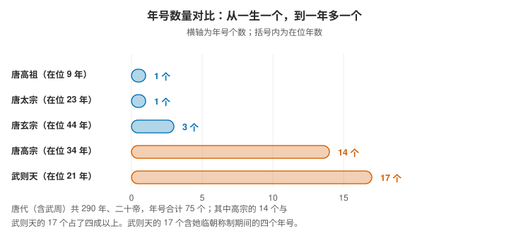
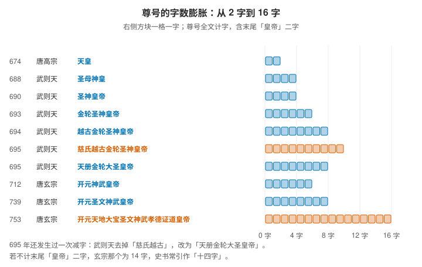

# 改名狂魔武则天

> 这个标题是句玩笑话，但下面这些数字不是：唐太宗在位二十三年只用了一个年号，唐高宗三十四年里换了十四个，武则天二十一年换了十七个。她同时把自己的尊号从四个字堆到十个字，把中书省改名凤阁、门下省改名鸾台，还把叛将的名字从"李尽忠"改成"李尽灭"。
>
> 改名在这对夫妻手里不是爱好，是一件有用的政治工具。

> **目录**
>
> - 一、先摆清单：他们改了哪几样东西
> - 二、年号：从一生一个，到一年多一个
> - 三、年号的名字为什么越来越长
> - 四、尊号：皇帝称号的字数是怎么堆上去的
> - 五、官职与机构的改名
> - 六、给别人改名：赐恶名与改恶姓
> - 七、为什么改名是一件有用的事
> - 八、余波：这个习惯留了下来
> - 九、尚未解决的问题

## 一、先摆清单：他们改了哪几样东西

| 改的对象 | 改什么 | 例子 |
|---|---|---|
| 时间 | 年号 | 贞观 → 万岁通天 |
| 皇帝本人的称谓 | 尊号 | 天皇 → 天册金轮大圣皇帝 |
| 机构 | 官署名 | 中书省 → 凤阁 |
| 官职 | 官名 | 中书令 → 内史 |
| 别人 | 姓名与姓氏 | 李尽忠 → 李尽灭 |
| 祖先 | 谥号 | 太武皇帝 → 神尧大圣大光孝皇帝 |

从时间、机构、官名，一路改到别人的姓名和祖宗的谥号——这张表就是本文要展开的全部内容。

## 二、年号：从一生一个，到一年多一个



| 皇帝 | 在位年数 | 年号数 |
|---|---|---|
| 唐高祖 | 9 年 | 1（武德） |
| 唐太宗 | 23 年 | 1（贞观） |
| 唐玄宗 | 44 年 | 3（先天、开元、天宝） |
| 唐高宗 | 34 年 | 14 |
| 武则天 | 21 年 | 17 |

唐代（含武周）二百九十年、二十帝，年号合计 **75 个**；其中唐高宗的 14 个与武则天的 17 个就占了四成以上。

武则天的 17 个，含她临朝称制期间的四个：

```text
临朝期：光宅（684）、垂拱（685—688）、永昌（689）、载初（689—690）
称帝期：天授、如意、长寿、延载、证圣、天册万岁、万岁登封、
        万岁通天、神功、圣历、久视、大足、长安
```

把唐太宗与武则天放在一起看，对比最清楚：**一个二十三年只用"贞观"，一个二十一年换了十七个**。平均下来，武则天一年多就要改一次元。

## 三、年号的名字为什么越来越长

把武则天的年号按时间排开，会发现字数在往上走：

```text
天授（2 字）→ 证圣（2 字）→ 天册万岁（4 字）→ 万岁登封（4 字）→ 万岁通天（4 字）
```

两个四字年号都跟**封禅**有关："万岁登封"与"万岁通天"都指向她封禅嵩山这件事。封禅是帝王祭告天地的典礼，而武则天选择的是嵩山，不是历代沿用的泰山。695 年到 696 年之间，年号连续换了三个：证圣 → 天册万岁 → 万岁登封。

年号不只是纪年工具，它还是**宣示天命与正统的载体**。落在武则天身上的名字——天授、天册万岁、万岁通天、证圣——都带着明显的神学色彩，取的正是"受命于天"的意思。相比之下，唐太宗的"贞观"用了二十三年不动，年号的稳定本身就是另一种政治信号。

## 四、尊号：皇帝称号的字数是怎么堆上去的



尊号是皇帝在世时的尊崇称号，与谥号、庙号、年号并列。这条路是从唐高宗这里开始加速的。

| 时间 | 人物 | 尊号 | 字数 |
|---|---|---|---|
| 674 | 唐高宗 | 天皇 | 2 |
| 688 | 武则天 | 圣母神皇 | 4 |
| 690 | 武则天 | 圣神皇帝 | 4 |
| 693 | 武则天 | 金轮圣神皇帝 | 6 |
| 694 | 武则天 | 越古金轮圣神皇帝 | 8 |
| 695 | 武则天 | 慈氏越古金轮圣神皇帝 | 10 |
| 695 | 武则天 | 天册金轮大圣皇帝 | 8 |
| 712 | 唐玄宗 | 开元神武皇帝 | 6 |
| 739 | 唐玄宗 | 开元圣文神武皇帝 | 8 |
| 753 | 唐玄宗 | 开元天地大宝圣文神武孝德证道皇帝 | 16 |

几点说明：

- **674 年那一步值得单记**：唐高宗受尊号"天皇"，武则天同时称"天后"，两人并称"二圣"。"天皇"只有两个字，但它是后来所有加字的起点。
- 从上往下读，字数从 4 字堆到 10 字；**695 年还出现过一次减字**——去掉"慈氏越古"，改为"天册金轮大圣皇帝"。也就是说，这套称号是可以加也可以减的。
- **终点在玄宗**：753 年的尊号全称 16 字。若不计末尾的"皇帝"二字，则是 14 字——史书常引的"十四字"就是这个算法，两种计数都不算错。
- **"慈氏"与"金轮"都来自佛教话语**：金轮取自转轮王，慈氏即弥勒。武则天用这套词汇，把皇权与佛教学说接在一起。

加尊号还有一套程序：通常由**群臣上表请加，皇帝谦让再三，群臣固请，然后接受**。玄宗开元二十七年加尊号就是"文武百官集体上表"的结果。这意味着尊号变长不只是皇帝一人的偏好，也是群臣表态的一种方式——把颂词写长，是当时最安全的表忠办法。

**连带的效应是谥号也被拉长。** 唐高祖的初谥是"太武皇帝"，后来被加至"神尧大圣大光孝皇帝"。这条线一直延伸到清代，皇帝的谥号已多达二十余字。

## 五、官职与机构的改名

唐代前期有两次成规模的机构改名，篇幅所限这里只列要点，细节见唐代官制一篇。

**唐高宗龙朔二年（662）**：门下省改称东台，中书省改称西台；门下侍中改称左相，中书令改称右相。咸亨元年（670）恢复旧名。

**武则天光宅元年（684）**：中书省改凤阁（长官称内史），门下省改鸾台（长官称纳言），尚书省改文昌台（左右仆射改称文昌左相、文昌右相），吏部改天官，其余五部改为地官、春官、夏官、秋官、冬官。神龙元年（705）恢复旧名。

改官名不只是换标签。凤阁、鸾台、文昌台这些名字都带祥瑞与天命色彩——**政权更替时把行政语汇整体换一遍，是最快建立"新朝感"的办法**。

于是同一职位在不同时期有三个名字：

```text
中书令  →  右相（662—670）→  内史（684—705）→  中书令
宰相加衔  →  同中书门下三品  →  同凤阁鸾台平章事  →  同中书门下平章事
```

## 六、给别人改名：赐恶名与改恶姓

这一类最能说明改名的性质：**它是一种公开的宣判**。

**赐恶名。** 万岁通天元年（696），契丹松漠都督李尽忠与孙万荣举兵反，武则天一边派兵平叛，一边下诏改名：

| 原名 | 改后 |
|---|---|
| 李尽忠 | 李尽灭 |
| 孙万荣 | 孙万斩 |

这不是私下改口，而是**写进诏书、用官方名义宣布**的名字。改名本身等于一句判词。

**改恶姓。** 武则天还推行过一套政治性的贬姓做法，把政敌的姓氏换成含毒蛇、恶鸟的字：

| 改姓 | 字义 | 对象 |
|---|---|---|
| 蟒 | 巨蛇 | 王皇后（655 年被废后） |
| 枭 | 食母之鸟 | 萧淑妃 |
| 蝮、虺 | 毒蛇、幼蛇 | 起兵反武的宗室一族 |

**改姓比改名更彻底：它连此人的族属都一并否认了。**

还要注意这套做法的另一面：**赐姓与改恶姓用的是同一支笔。** 把功臣改姓"李"是授予，把政敌改姓"虺"是剥夺——命名权从来是权力的一部分，只是写出来的字不同。

## 七、为什么改名是一件有用的事

三个功能，各自对应一类改名：

**1. 宣示天命。** 年号与部分尊号承担这个任务。天授、天册万岁、万岁通天都是神学话语，而武则天在这方面的需求比别人更迫切——她的统治需要一个超出常规的合法性来源。

**2. 重构符号秩序。** 机构改名让新政权在最短时间内把行政语汇整体替换一遍，从诏书的落款到官员的职衔，处处都是新朝气象。

**3. 惩罚与羞辱。** 赐恶名改恶姓把命名权变成判决书，成本极低而传播极广。

还有一个常被忽略的制度条件：**年号与尊号本来就是皇帝专属的符号**，改动成本低，传播力却最强——诏书一发，全国的纪年方式随之改变。换句话说，这套工具之所以有效，是因为它作用在所有人都必须使用的符号上。

## 八、余波：这个习惯留了下来

- **年号的频繁更替。** 唐代二百九十年 75 个年号，本身已属高频；宋代皇帝改元同样频繁；**到明清才回到基本一帝一号**。
- **尊号与谥号的持续加长。** 从唐高宗的两字，到玄宗的长名，再到清代谥号的二十余字，这条曲线一直在往上走。
- **赐恶名改恶姓。** 后世偶有沿用，但不再成为惯例。

有一个细节值得记住：**武则天改的官名，在神龙元年（705）被全部改了回来**——凤阁、鸾台、文昌台只留在了史书里。符号层面的改动会随政权一起被改回；真正留下来的，是这套做法本身，也就是频繁改元与不断加字的习惯。

## 九、尚未解决的问题

- [[唐代赐恶姓的完整清单与所涉人物]]
- [[武则天年号的准确计数（各书统计口径差异）与改元频率的统计方法]]
- [[尊号加字程序中群臣上表的具体流程与政治博弈]]
