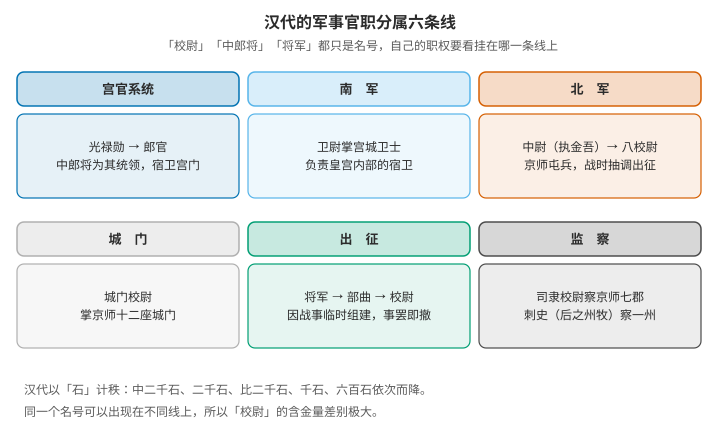
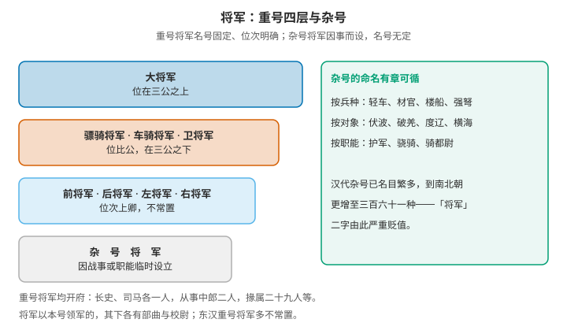
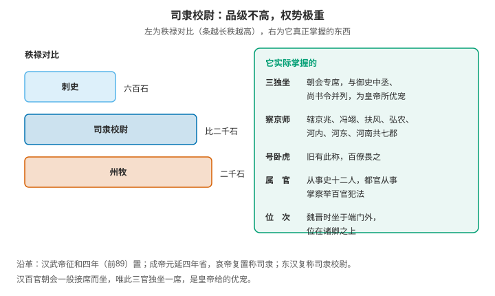

# 汉代的武官体系：重号与杂号将军、校尉，以及司隶校尉的特殊地位

汉代官制难在一点：官名与职权是两条独立的轴。"校尉""中郎将""将军"都只是名号，同一个名号可以挂在完全不同的系统上。最极端的例子是司隶校尉——顶着"校尉"这名号，秩级低于丞相司直，却是朝会上与尚书令、御史中丞并称"三独坐"的人物，辖京畿七郡，有"卧虎"之称。

## 一、汉代的军事官职分属六条线



汉代中央与京师的武职可以归到六条线上，各有各的隶属与职责：

| 线 | 主管 | 主要职守 |
|---|---|---|
| 宫官系统 | 光禄勋 | 郎官与宫门宿卫，中郎将为其统领 |
| 南军 | 卫尉 | 皇宫内部的宫城卫士 |
| 北军 | 中尉（后称执金吾） | 京师屯兵，由八校尉分掌，战时抽调出征 |
| 城门 | 城门校尉 | 京师十二座城门 |
| 出征 | 将军 | 战时临时组建，将军之下为部曲，部下设校尉 |
| 监察 | 司隶校尉、刺史 | 前者察京畿七郡，后者察一州 |

这个划分解释了一个常见的困惑：为什么有的"校尉"统领精锐、有的"校尉"却能监察百官。因为校尉只是名号，职权由它所在的那条线决定。

## 二、将军：重号与杂号



将军分两大类。重号将军名号固定、位次明确，通常有四个层级：

| 层级 | 名号 | 位次 |
|---|---|---|
| 一 | 大将军 | 位在三公之上 |
| 二 | 骠骑将军、车骑将军、卫将军 | 与公同级，在三公之下 |
| 三 | 前将军、后将军、左将军、右将军 | 位次上卿，不常置 |
| 四 | 杂号将军 | 因事而设，名号无定 |

杂号将军是"因战事或职能临时设立"的一类，命名其实有章可循：

- 按兵种：轻车、材官、楼船、强弩、骑；
- 按征伐对象或目的：伏波、破羌、度辽、横海、戈船；
- 按职能：护军、骁骑。

需要说明的是，汉初重号与杂号的区分并不严格，很多名号都是临时指派的；这套分类是后来才逐渐严密的。到了南北朝，杂号将军的名目竟多至三百六十一种——"将军"二字由此严重贬值。

两点制度细节：

- 重号将军均开府，府属有长史、司马各一人，从事中郎二人，掾属二十九人，令史御属三十一人；
- 将军以本号领军的，其下各有部曲与校尉——这是"校尉"的第四个出处（另见下节）。

东汉时重号将军多不常置。光武帝时，吴汉以大将军为大司马，景丹为骠骑大将军，位在公下。

## 三、校尉：同一个名号，四种职守

"校尉"在汉代至少指向四种完全不同的职位：

一、八校尉（北军禁卫部队长官）——汉武帝置，隶属北军：

| 校尉 | 职守 |
|---|---|
| 中垒校尉 | 掌北军垒门内外（原为中尉属官，武帝时分出并升为校尉） |
| 屯骑校尉 | 掌骑士 |
| 步兵校尉 | 掌上林苑苑门屯兵 |
| 越骑校尉 | 掌来自越地的骑兵 |
| 长水校尉 | 掌长水胡骑 |
| 胡骑校尉 | 掌胡骑，非常设 |
| 射声校尉 | 掌待诏射声士 |
| 虎贲校尉 | 掌轻车 |

每校统兵约七百人（一说八百），总兵力六千余。秩二千石；东汉省去中垒、胡骑，剩下屯骑、步兵、越骑、长水、射声，即所谓北军五校，秩比二千石。

二、城门校尉——掌京师十二座城门。

三、司隶校尉——是监察官，不是军事长官（详见第六节）。

四、将军部曲的校尉——将军领兵时，部下分设校尉，属出征系统。

所以"某某校尉"四个字本身不含信息量：要看后面那个词是什么，以及它挂在哪条线上。

## 四、中郎将：宫官系统的一支

中郎将属于宫官系统：秦置中郎，西汉分五官、左、右三中郎署，各置中郎将以统领皇帝侍卫，隶属光禄勋；后来又增设虎贲中郎将、羽林中郎将，秩比二千石，低于诸将军。郎的职责是"宿卫门户、执兵扈从"，所以中郎将的性质是皇帝身边的侍从武官长。

它与唐代那个由骠骑将军改称而来的中郎将完全是两回事，前一篇已经做过逐项对照，此处不重复。需要补充的是，汉代也有因事而设的中郎将——如使匈奴中郎将，是派往匈奴的常驻代表，其名号虽同为中郎将，职责却在出使而不在宿卫。

## 五、"石"是品秩刻度，不是职权说明

汉代的官阶用"石"表示，但它标的是秩级，不是实发数额——实际发放按斛计的谷粮。例如二千石这一级，月得谷约一百二十斛。

常见的秩级由高到低：

```text
万石（三公）
 └ 中二千石（九卿）
    └ 二千石（郡太守、八校尉）
       └ 比二千石（郡都尉、中郎将、司隶校尉）
          └ 千石（御史中丞）
             └ 六百石（刺史、县令）
                └ 比六百石（县尉）
                   └ 四百石、三百石、二百石、百石
```

理解汉代官制，要抓住秩级与职权是两条独立的轴。秩级决定朝会位次与俸禄，职权决定能管什么、能管谁。两条轴有时一致，有时严重背离——下一节就是背离得最厉害的例子。

## 六、司隶校尉：位卑权重的极端案例



沿革：始置于汉武帝征和四年（前89）；成帝元延四年（前9）省去；哀帝时复置，省去"校尉"而称司隶；东汉复称司隶校尉。

职责：监督京师与周边地方，辖京畿七郡——京兆、左冯翊、右扶风（三辅）、弘农、河内、河东（三河）、河南尹。属官有从事史十二人，其中都官从事掌察举百官犯法。

秩级：西汉为二千石，东汉改为比二千石。这个数字低于丞相司直，也低于它所监察的许多对象——但它有"卧虎"的旧号，京师百僚畏之。

这就是"位卑权重"的典型：名号照旧叫"校尉"，秩级也不高，可它管的是京畿七郡的百官监察，相当于一州之地。汉末它是权臣必争之位——曹操掌控朝廷后曾自任司隶校尉，蜀汉方面张飞去世后诸葛亮也曾兼任此职。

## 七、三独坐：朝会上的特权

最直观的特权出现在朝会上。

光武帝特诏：朝会时为司隶校尉、御史中丞、尚书令设专座，合称"三独坐"。

对比很能说明问题：汉代百官朝会一般接席而坐——多人共用一席；唯独这三个官独坐一席，是皇帝给予的优宠，所以京师号之曰"三独坐"。到魏晋，司隶校尉更是坐于端门之外，位在诸卿之上。

三官能并列是有道理的，它们的共性是都居于皇帝身边的监察与机要位置：

- 御史中丞：掌监察，秩千石；
- 尚书令：掌章奏文书，是后来尚书省长官的前身；
- 司隶校尉：掌京畿七郡的监察。

一个是皇帝的耳目，一个是皇帝的笔，一个是皇帝在京师的手。

## 八、司隶校尉、州牧与刺史

这三者的关系需要一段沿革才能说清，而司隶校尉"与州牧同级"这个印象正是从这里来的。

汉武帝元封五年（前106）置十三部刺史，秩仅六百石，而它所监察的对象是秩二千石的郡太守。这是有意的制度设计：用低级官监察高级官——秩轻则勇于任事，且刺史若有成绩，很容易被提拔为二千石，因此不会与地方势力合流。

汉成帝绥和元年（前8），丞相翟方进与大司空何武上奏，认为刺史秩仅六百石却考察二千石的郡守，是"以卑临尊"，与《春秋》"用贵治贱，不以卑临尊"的大义不合，于是罢刺史，改置州牧，秩提到二千石。此后制度屡有反复：哀帝建平二年（前5）复为刺史，元寿二年又改为牧；东汉建武十八年（42）恢复刺史，只设十二人，剩下的一州隶属司隶校尉。

十三州部之中，十二州设刺史，剩下的一州（京畿）归司隶校尉管辖。所以司隶校尉在职能上相当于一州的监察长官，只是名号与秩级另有来路。

最后一步发生在汉灵帝中平五年（188）：采纳太常刘焉的建议"废史立牧"，改刺史为州牧，总揽一州的行政、军事与财政大权。州由此从监察区变成郡以上的一级行政区，汉末的割据局面也由州牧擅兵而形成。

| 官职 | 秩级 | 辖区 | 性质 |
|---|---|---|---|
| 刺史（西汉） | 六百石 | 一州 | 监察，无固定治所 |
| 州牧（成帝以后） | 二千石 | 一州 | 名称与秩级提升，职权逐步军政合一 |
| 司隶校尉（东汉） | 比二千石 | 京畿七郡，相当一州 | 监察 |

司隶校尉与州牧的秩级确实大致相当，而远高于六百石的普通刺史——这个反差正是"看着是校尉却比州牧还难惹"这一印象的来历。

## 九、还有几处没查清

- [[东汉北军五校与西汉八校尉的职能差异，以及中垒、胡骑二校尉被省去的原因]]
- [[杂号将军的名号统计：按兵种、按对象、按职能命名的各占多少]]
- [[除三独坐之外，汉代朝会还有哪些位次上的优待，其与秩级为何并不完全一致]]
