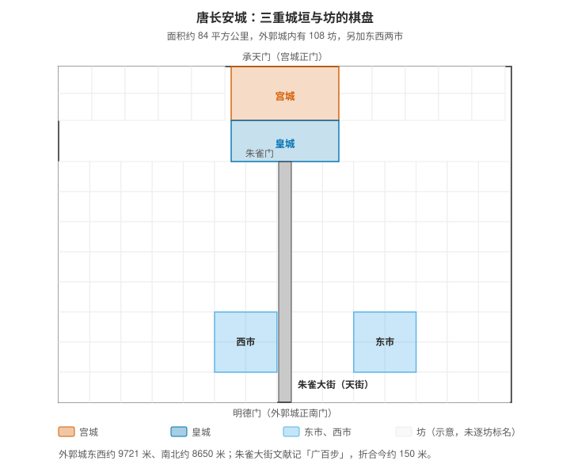
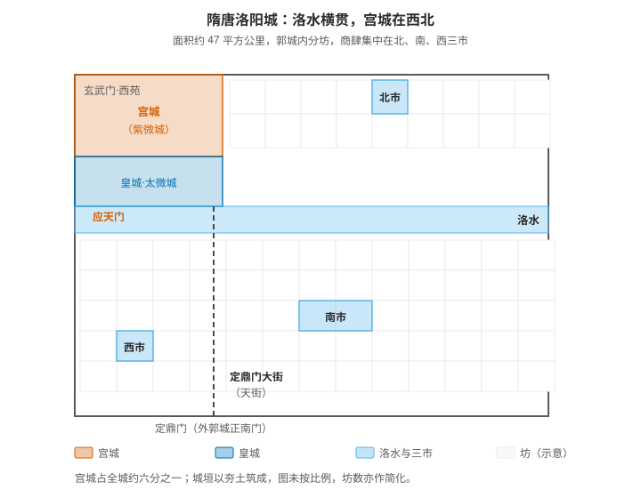
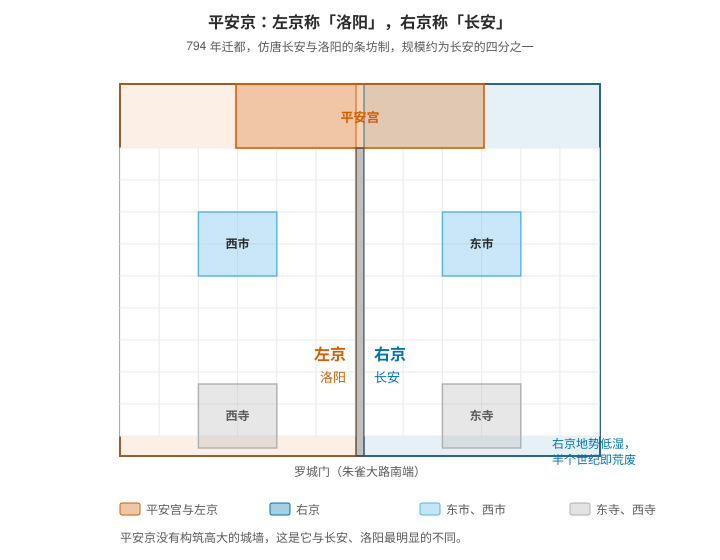

# 长安与洛阳的棋盘格：坊市制度、坊名与平安京的模仿

唐代的两座都城都长成棋盘：纵横的街道把城切成一个个方块，方块是坊，商业被集中到少数几个"市"里，入夜则坊门关闭。这套"里坊制"是唐代城市最鲜明的特征。它后来被整套搬到了日本——平安京的朱雀大路、条坊制与左右对称都照着长安与洛阳做，连两半城的名字都一起搬走：左京叫洛阳，右京叫长安。

## 一、两座城的骨架

| | 唐长安 | 隋唐洛阳 |
|---|---|---|
| 面积 | 约 84 平方公里 | 约 47 平方公里 |
| 宫城位置 | 郭城北部**正中** | 郭城**西北角** |
| 水系 | 八水环绕，城内少有穿城河道 | **洛水横贯城中** |
| 商业区 | 东市、西市（各占两坊） | 北市、南市、西市 |
| 中轴 | 朱雀大街 | 定鼎门大街（天街） |

共同点是三样：中轴对称、里坊化（棋盘格）、坊市分离。差异的根源很清楚——长安建在平地上，可以从容地把《周礼·考工记》"匠人营国"那套方正居中的理想铺开；洛阳要让开洛水与既有地形，只能把宫城挤到西北角。

## 二、唐长安：三重城垣与一个棋盘



长安由三重城垣组成：

- 宫城在郭城北部正中，是皇帝居住与听政之处，正门是承天门；
- 皇城紧贴宫城之南，是中央官署所在，正门是朱雀门；
- 外郭城包住前两者，东西约 9721 米、南北约 8650 米，周长约 36.7 公里，面积约 84 平方公里。

外郭城内的骨架是一张棋盘：东西向 14 条街、南北向 11 条街，合计 25 条大街，把全城切出 108 个坊，另有东市、西市各占两坊（部分文献记作 110 坊或 109 坊，差别在于是否把两市算作坊）。

中轴是朱雀大街。它北起皇城的朱雀门，南抵外郭城正南门明德门，文献记其"广百步"，折合今约 150 米；考古勘探的宽度多在 150 至 155 米之间。这比今天绝大多数城市的主干道都宽，而它是一条一千多年前的土路。

一个考古细节能说明这条街的等级：朱雀大街遗址上发掘出五座并列的桥梁，其中中桥正对着明德门的五门道中门，一线贯通，毫无偏移。

## 三、隋唐洛阳：为什么它跟长安不一样



洛阳始建于隋大业元年（605），面积约 47 平方公里。它同样有三重城垣，名字却另有一套：

- 宫城叫紫微城，东西 2100 米、南北 1840 至 2160 米，面积约 4.2 平方公里；正南门是应天门；
- 皇城叫太微城，在宫城之南，是官署区；
- 郭城在外，城垣全部以夯土筑成，基址宽 15 至 20 米。

最大的差别是宫城的位置。长安的宫城摆在北部正中，洛阳的宫城压在西北角；城市的形状也不方正——东墙 7312 米、南墙 7290 米、西墙 6776 米、北墙 6138 米，长短不齐。原因在于洛水横贯城中：城市要先服从河流与地形，方正只是尽可能。

洛阳的中轴是定鼎门大街（又称天街）：由外郭城正南门定鼎门向北，跨过洛水上的"曰"字形五座桥，直抵宫城正南门应天门。

商业区的配置也与长安不同——洛阳有三个市：北市在城北部中心，占一个坊；南市在城南偏东的中心，占两个坊；西市在城南偏西、紧靠城墙，占一个坊。三个市里，南市的规模最大。

## 四、坊市制度：一座按时开关的城市

坊是四面有夯土墙的封闭小区，不是开放街区：四面开坊门，钥匙由坊正掌管，坊门按时开闭。坊内禁止经商，商业被集中到"市"里——这就是"坊市分离"。

时间管得比空间更严：

| 时段 | 规定 |
|---|---|
| 正午 | 市场击鼓开市 |
| 日入前七刻 | 击钲散市 |
| 日落 | 承天门先击鼓，各街街鼓相和，坊门随之关闭 |
| 入夜 | 实行宵禁，无官方凭证夜行称"犯夜"，要受罚 |

到唐玄宗开元年间，这套做法被固定为街鼓制度。违法的代价写进了律令——《唐律疏议》（653 年颁行）有一条：

```text
诸越官府廨垣及坊市垣篱者，杖六十。
```

翻越官署或坊市的墙，要打六十杖。

唐代长安的夜晚是黑的。今天常提的"大唐不夜城"是一个现代误会：那时的城入夜即闭，居民夜里能在坊内活动，但踏出坊门就是犯夜。制度后来才松动——唐中后期坊墙渐被侵街打破，夜市出现，坊市制走向瓦解，最终在宋代被开放的街市取代。

## 五、坊名：城里最会取名的地方

长安的坊名大多由道德与祥瑞的字眼构成，重名率极低：

```text
崇仁、亲仁、安仁、怀仁、崇德、怀德、崇义、通义、敦义、
延寿、延福、丰乐、安邑、升平、永宁、永乐、修政、敦化……
```

其中两个坊因功能而出名：

- 平康坊紧邻东市与皇城，唐时称"北里"，是长安最著名的坊之一，名妓聚居——"北里"后来成了专有名词。
- 崇仁坊靠近东市与春明门，旅馆与举子云集。每逢科举年份，这一坊的客舍爆满，是全城人口流动最快的地方。

洛阳的坊名同样讲究，比如履道坊——白居易晚年住在洛阳履道坊的宅子里，园池自适，写下了《池上篇》。他的宅子占了履道坊西部的大半，是"坊内可以有园林"的一个实例。

## 六、东西两市：商肆为什么不能开在坊里

长安的两个市各占两坊，位置东西对称，功能却不一样：

- 东市靠近皇城与权贵宅邸，商品档次更高，文献记其有二百二十行；
- 西市更国际化，胡商集中，唐代又有"金市"之称。

市里由市署管理，市门按时开闭。同行业的店铺集中成一"行"——绢行、肉行、金银行、马行、药行等，这种"行"的聚集方式，是唐代商业组织的典型形态。

坊市制度对商业是一种约束：交易时间固定在白天、地点固定在市里，店铺不能开到坊内去。它的松动正是从这两条开始的——延长营业时间与越界开店。理解这一点，就能理解为什么宋代的城看上去完全不同：街市取代了坊市，店铺沿街生长，城市从"围墙里的方块"变成了"沿街的连续带"。

## 七、平安京：左京叫洛阳，右京叫长安



794 年（延历十三年），桓武天皇迁都平安京；此后直到 1869 年（明治二年），它一直是日本的首都，历时一千余年。它从一开始就是照着唐代的洛阳城与长安城造的，采用唐的两京制度。

- 朱雀大路是主轴，北起平安宫，南抵罗城门，把京城分成左京与右京（宽度说法不一，约在 74 至 84 米之间）；
- 左京在东侧，称"洛阳"；右京在西侧，称"长安"——方位以天皇面南而定，左即东方；
- 规模约为长安的四分之一；
- 左右京面积相等、街路区划一致、坊数相同；南部东市与西市位置对称，罗城门内两侧的东寺与西寺并列而对应，几乎不差分毫。

两半城的命运并不一样。右京（长安）地势低湿、沼泽多，过了半个世纪就逐渐荒废，成为贫民区；左京（洛阳）则日益繁华，贵族官邸与寺院向北郊和鸭川一带发展。京都事实上以"洛阳"这一半为主。

这个偏斜留下了一整套语言痕迹，至今可见：进京叫"上洛"，市区分为洛中、洛西、洛东、洛北、洛南，京都的街道仍沿用条坊时代的名字——一条通、二条通、三条通，一直到九条通。

两千多公里外的一座城，把"洛阳"这个名字用了一千二百年。

## 八、抄走了什么，没抄什么

| 要素 | 长安与洛阳 | 平安京 |
|---|---|---|
| 宫城居北、中轴对称 | 有 | 有（平安宫在北部中央） |
| 条坊制棋盘格 | 有 | 有 |
| 中轴大街（朱雀大路） | 有 | 有，且沿用了同名 |
| 东西对称的两个市 | 有 | 有 |
| 两京并称、左右分名 | 有（长安、洛阳两都） | 有，直接用作左右京之名 |
| 高大的城墙 | 有（夯土多重城垣） | 没有 |

差异最大的一项是城墙。平安京只设了罗城门等城门，没有构筑包围全城的高大城垣。原因很简单：孤悬海外，当时没有能威胁它的外部力量，真正的风险都在朝廷内部——而城墙挡不住内部的政治斗争。

平安京抄走的是城市规划的几何：中轴、条坊、左右对称、市的位置，以及"两京"这套命名制度；没有抄的是城防。它最有意思的取舍，是把长安与洛阳的关系也一起搬了过来——两半城分别占了一个名字，各占一半。

## 九、还有几处没查清

- [[唐长安城东西两市"行"的完整清单与各行各业的分布]]
- [[平安京条坊制与长安里坊制在管理方式上的具体差异（坊正、宵禁是否照搬）]]
- [[洛阳与长安坊名的命名偏好差异，以及坊名与坊内居民身份的对应关系]]
