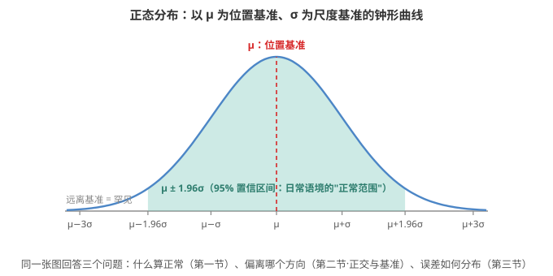

# Normal 的四重含义：正常、法向量、正态分布与师范

同一个英语词，同时是"正常""法向量""正态分布"和"师范"。四个毫不相干的领域共用一个词，是因为它们共享同一个拉丁词根 **norma**——木匠画直角用的那把矩尺，引申为"规范、标准"。

## 一、日常与通用语境：正常

日常意义上的 normal 表示符合常规预期或群体平均水平的状态，本质上以统计均值为基准。把它量化：设群体样本为 {x₁, x₂, …, xₙ}，则"正常范围"通常定义为均值 μ ± kσ（k 为标准差倍数，如医学中常用 k = 1.96 对应 95% 置信区间）。应用上，医学里空腹血糖正常范围 3.9–6.1 mmol/L，基于人群检测数据的统计基准；社会科学里通过问卷调查确定"正常社交频率"的中位数基准（如每周 3–5 次面对面交流）。

## 二、数学领域：法向量

法向量是垂直于平面、曲线或曲面的向量，其基准性体现为几何正交性。代数上，平面 Π: Ax + By + Cz + D = 0 的法向量 n = (A, B, C)，满足 n·v = 0 对平面内任意向量 v 成立；曲线 C 在点 P 处的法向量 n(P) 与切向量 τ(P) 正交，即 n(P)·τ(P) = 0。在微分几何里，曲面 S 的法向量场 N(u, v) 用于定义第二基本形式 II = Ldu² + 2Mdudv + Ndv²，描述曲面弯曲的基准方向。词源上有一处特别：norma 作为木工工具，本职就是画直角、校方正，"垂直"是它最初的那件事，谈不上引申。

## 三、统计学领域：正态分布

正态分布是以均值 μ 为位置基准、标准差 σ 为尺度基准的概率分布，其密度函数为：

$$f(x; \mu, \sigma^2) = \frac{1}{\sigma\sqrt{2\pi}} \exp\left(-\frac{(x - \mu)^2}{2\sigma^2}\right)$$

它凭什么当"基准"：最大熵性质——在给定均值和方差的连续分布中，正态分布具有最大熵，是"最随机"的基准分布；中心极限定理（CLT）——当独立同分布随机变量 Xᵢ 满足 E[Xᵢ] = μ、Var(Xᵢ) = σ²，则 (ΣXᵢ − nμ)/(σ√n) 依分布收敛于标准正态 N(0, 1)，表明均值 μ 是渐近分布的天然基准。典型应用：测量误差建模中，μ 代表真实值，σ 反映仪器精度，误差分布以 μ 为中心形成基准钟形曲线。

## 四、教育领域：师范

最让中文使用者困惑的一重：北京师范大学的英文名是 Beijing Normal University，华东师大是 East China Normal University——英文名里的 normal 说的是"为教师行业确立规范的学校"，跟"正常"无关。

整条词源链是：拉丁语 norma（矩尺、准则）→ normalis（合乎矩尺的、标准的）→ 法语 école normale（规范学校）→ 英语 normal school（师范学校）→ 汉语与日语的"师范学校"。整条链上，normal 一直是"规范、标准"的意思，从未变成"普通"。

历史：最早的一所是法国大革命期间创办的巴黎高等师范学校（École normale supérieure，1794 年），校名的字面意思是"确立教学规范的学校"。法国至今把该校学生称作 normalien。英语世界在 19 世纪前期引入这一概念，用 normal school 专指培养教师的学校，各州设"州立师范学校"（State Normal School）。这类学校后来陆续升格为州立大学，normal school 这个用法在英语里随之废弃，只在少数地名里留下痕迹——美国伊利诺伊州的 Normal 市，就是因当年的州立师范学校得名的。日本明治年间把它译作「師範学校」，汉语里的"师范学校"与许多教育术语一样，是清末经日译借入的。韩语至今把师范院校称作 사범대학，用的仍是这两个汉字。

汉译为何取"师范"而非音译：这是意译。汉语本来就有"师范"一词，汉代扬雄《法言·学行》说"师者，人之模范也"——"师范"即"堪为师者之模范"。而 norma 的本义正是"规范、模范"。两边的所指严丝合缝，这个译名不仅达意，还把原词根的意思完整搬了过来。

前三项有一个共同点：都以某物为基准——以常态为基准、以正交为基准、以均值为基准；师范更进一步，它是教人如何成为标准的地方。

## 附记：四个义项共用一根矩尺

四个义项的公共词根是拉丁语 norma——木匠用来画直角、校验方正的那把矩尺，引申义为"规则、标准"。从这把尺子出发：

| 义项 | 从"矩尺"到这里 |
|---|---|
| 正常 | 符合规矩的 → 符合常态的 |
| 法向量 | 矩尺的本职工作就是定直角 → 垂直于面或曲线的方向 |
| 正态分布 | 被当作标准的那一个分布 |
| 师范 | 字面是"规范学校"，即为教师树立标准的学校 |

顺带一提，同族词里还有 norm（规范）、normalize（规范化），以及看上去毫不相干的 enormous——它的拉丁语源 enormis 是"出格的、不合规矩的"，原本与"巨大"无关。
