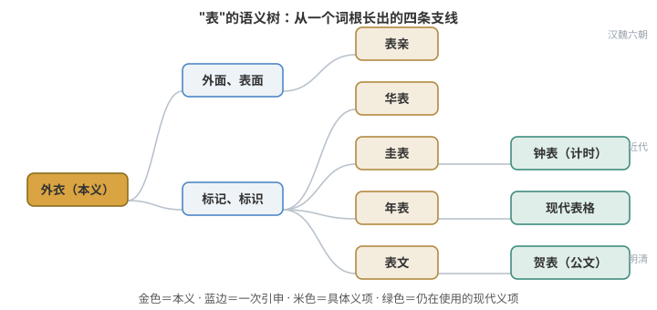

# "表"字的语义演变时间线

> **目录**
>
> - 一、《说文解字》怎么说
> - 二、从本义到各个义项的演变
>     - 第一阶段：先秦——从"外衣"到"外面"到"标记"
>     - 第二阶段：汉代——两个完全不同的义项同时出现
>     - 第三阶段：汉魏六朝——表亲
>     - 第四阶段：明清——贺表
>     - 第五阶段：近代——钟表 + 现代表格
> - 三、一张图理清所有义项的关系
> - 四、四条并行的发展线

## 一、《说文解字》怎么说

《说文解字·衣部》：

> 表，上衣也。从衣从毛。古者衣裘，以毛为表。

意思是："表"就是外衣，字形是"衣"字里面一个"毛"。古代人穿皮衣，毛的一面朝外，所以穿在外面的衣服就叫"表"。

**本义：外衣、穿在外面。这是所有义项的根。**

## 二、从本义到各个义项的演变

### 第一阶段：先秦——从"外衣"到"外面"到"标记"

**1. 本义：外衣**

表 = 外衣。跟"里"（内衣）相对。

**2. 引申：外面、表面**

既然外衣穿在外面，"表"就引申为"外面"。与"里"对举：表里如一、由表及里。

《庄子·胠箧》："……彼曾、史、杨、墨、师旷、工倕、离朱者，皆外立其德而以爚乱天下者也。"——"外立其德"就是把德行显露在外面。

**3. 引申：标记、标识**

既然"表"是露在外面能看见的，就引申为"立个标记让你看见"。

- 表木 / 华表：古代在路口立一根木柱，作为道路标记，也叫"表木"。这就是天安门前华表的原型。
- 《管子·君臣上》："犹立表而望朝夕之景也。"——就像立个表杆来看早晚的日影。

**4. 引申：测日影的杆子（圭表）**

立一根杆子在地上，看太阳照出来的影子长短，来定节气、定方向。这根杆子就叫"表"，底座叫"圭"，合称"圭表"。这是中国最早的天文仪器。这个义项直接演变成了后来的"钟表"。

### 第二阶段：汉代——两个完全不同的义项同时出现

**5. 司马迁的"年表"（《史记》十表）**

司马迁创了一种史书体裁，叫"表"。竹简是长条编联的，不是现代方格纸。司马迁的"表"实际上是按时间轴排列的大事记：

- 一根竹简记一个时间段（比如某一年）
- 编联起来之后，横向是时间，纵向是事件
- 原简不是方格表格，是文字按时间线排列
- 现代印刷版做成表格样式，是后人排版的结果，为了方便阅读

为什么叫"表"？因为它是把历史事件条理化地陈列出来，像标记一样一行一行列清楚——从"标记"义项来。《史记》十表：三代世表、十二诸侯年表、六国年表、秦楚之际月表、汉兴以来诸侯王年表……

**6. 表文（奏章）**

汉代另一个"表"，是臣下给皇帝的公文。为什么叫"表"？因为臣下要把事情陈列出来让皇帝看，跟"陈列、标记"是同一个动作。著名的：诸葛亮《出师表》、李密《陈情表》、曹植《求自试表》。

"表举你为徐州牧"——上表推荐你，就是写一封奏章向皇帝推荐。这个"表"是公文格式，不是表格。跟司马迁的"表"共享同一个词源（陈列出来），但用途完全不同。

### 第三阶段：汉魏六朝——表亲

**7. 表亲（表兄弟、表姐）**

为什么姑表、姨表、舅表的亲戚叫"表"？因为"表" = 外面。

- 堂兄弟：同姓同族，住在一个堂屋里（堂屋 = 正房），叫"堂"
- 表兄弟：异姓亲戚，是"外面"的亲戚，从"表 = 外"引申

这个用法大概在魏晋南北朝定型，到唐宋就完全普及了。

### 第四阶段：明清——贺表

**8. 贺表**

明清两代，逢元旦、冬至、皇帝生日（万寿节），文武百官要上一道祝贺奏章，叫"贺表"。这个还是从"表文"来的，就是一种格式化的祝贺公文，跟《出师表》那个"表"是同一个文体，只是内容从"陈述事情"变成了"祝贺"。

### 第五阶段：近代——钟表 + 现代表格

**9. 钟表（手表、怀表）**

这个义项直接追根溯源到先秦的圭表（测日影的杆子）。逻辑链：

先秦圭表（测日影的杆子）→ 日晷（用表杆影子计时）→ 近代机械钟表传入中国 → 中国人用"表"来翻译这种"测量时间的仪器"

所以"手表"的"表"，跟祖先在西周立在土台上测冬至的那根杆子，是同一个词。

**10. 现代表格（方格文书）**

近代西方的 table（表格、数据表）传入中国，翻译时用了司马迁的"表"字。因为司马迁的年表就是"按行列排列信息"，跟西方的 table 功能对应。所以今天填的"报名表""课程表""工资表"，词源上接的是《史记》十表那条线。

## 三、一张图理清所有义项的关系



```text
本义：外衣（穿在外面）
  │
  ├─→ 外面、表面 ──→ 表亲（外亲，异姓亲戚）
  │
  ├─→ 标记、标识
  │     │
  │     ├─→ 华表（立木为标记）
  │     │
  │     ├─→ 圭表（测日影的杆子）──→ 钟表（计时仪器）
  │     │
  │     ├─→ 年表（条理化排列历史）──→ 现代表格（方格文书）
  │     │
  │     └─→ 表文（陈列事情给皇帝看）──→ 贺表
  │
  └─→ （填表、戴表、叫表兄，都是从这棵树长出来的）
```

## 四、四条并行的发展线

把上面的义项按来源归拢，"表"字两千多年间长出了四条相互独立的语义支线：

1. **"外面"线**：外衣 → 表面 → 表亲（异姓的外亲）
2. **"标记"线的仪器支**：表木 → 圭表 → 日晷 → 钟表
3. **"标记"线的文书支**：标记 → 年表 → 现代表格；标记 → 表文 → 贺表
4. **时间上的分叉点**：文书支里的"年表"与"表文"同在汉代出现，词源同为"陈列出来"，但体裁一为史书体例、一为臣下公文

其中"钟表"与"现代表格"虽然都是近代产物，却分别接在先秦圭表与汉代年表两条最古老的枝上。
