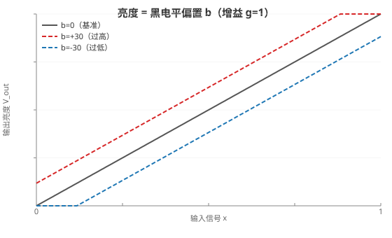
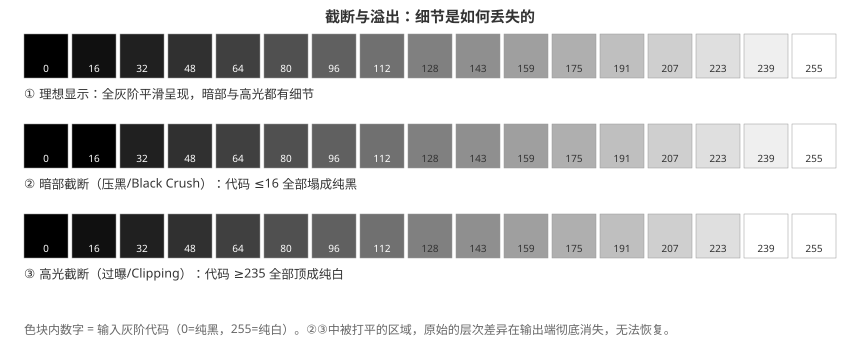
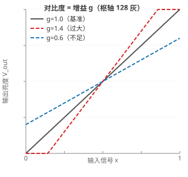
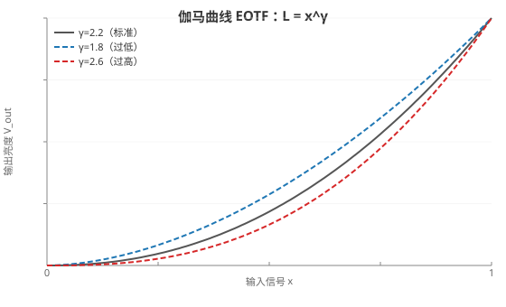
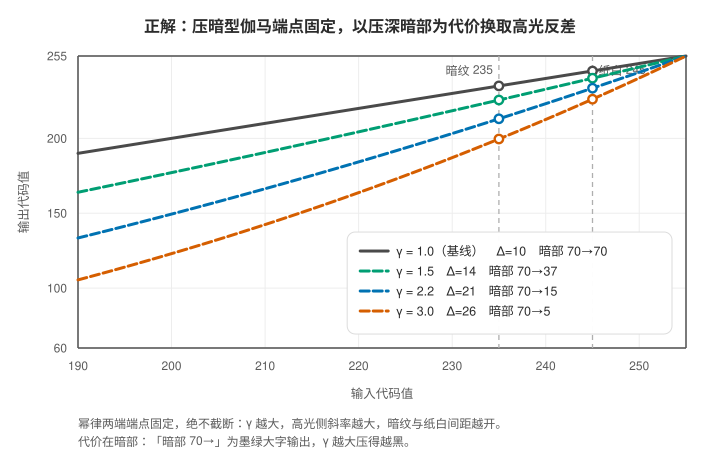
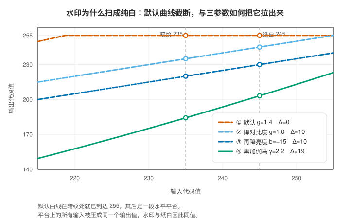
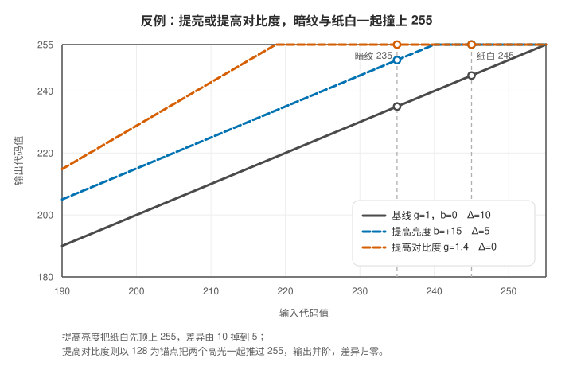
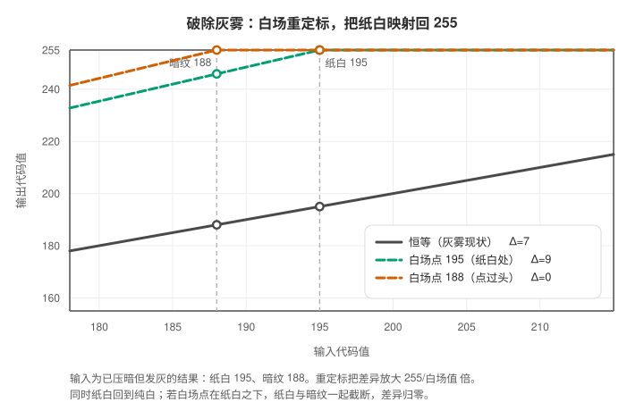

# 扫描仪三参数：亮度、对比度与伽马的点运算

扫描仪驱动界面上的"亮度（Brightness）"、"对比度（Contrast）"和"伽马（Gamma）"三根滑块，最终都落到数字图像处理里的同一类算子——**点运算（Point Operations）**：输出像素的取值只由同一位置的输入像素决定，与邻域像素无关。驱动在灰度映射环节上依次施加这三种运算，所以三个滑块彼此耦合，稍有叠加就很难凭直觉微调。

这篇笔记分两段。前半段把三个参数各自的数学模型、截断边界与符号约定逐项写清；后半段落到一个具体场景——**扫描件上那层淡淡的水印或暗纹，为什么常常扫出来是一片纯白，又该怎么把它拉出来**。后者的结论可以先给出来：那股"暗"不是暗部，而是极其接近纯白的高光细节，正确方向不是增强暗部，而是先降亮度、降对比度把高光从 255 截断区拉回来，再用伽马把这被压扁的几级差异重新放大。

> **目录**
>
> - 一、归一化与统一映射框架
> - 二、符号约定与选用理由
> - 三、亮度：线性直流偏移
> - 四、对比度：以中性灰为锚点的增益
> - 五、伽马：固定端点的幂律变换
> - 六、三者级联时的完整成像映射
> - 七、数值验证：一对相邻灰阶的存亡
> - 八、落到具体场景：把纸上的淡淡水印拉出来
>     - 水印落在高光，不是暗部
>     - 为什么它扫成了纯白
>     - 三条被实测推翻的直觉
>     - 完整配方与它的解释
>     - 收尾：画面整体发灰怎么办
>     - 另外两条值得知道的路
> - 九、结论
> - 十、尚未解决的问题

## 一、归一化与统一映射框架

扫描仪输出的原始灰度是八位无符号整数，记作代码值 I_in，取值范围为 {0, 1, …, 255}，其中 0 表示纯黑、255 表示纯白。为便于讨论连续映射，先把它线性归一化到单位区间：

$$x = \frac{I_\text{in}}{255}, \quad x \in [0, 1]$$

整条数据通路上，被三根滑块改动的只有一个环节：从归一化输入 x 到归一化输出 y 的逐点映射，也就是灰度传递函数（Transfer Function）T(·)：

$$y = T(x), \quad T: [0, 1] \to [0, 1]$$

亮度、对比度与伽马各自给出 T 的一种具体形式，三者级联时又复合成一个新的 T——后文的所有公式都是在展开这个 T。它作用完毕之后，再把 y 还原回八位代码值：

$$I_\text{out} = \text{clip}\big(\text{round}(y \cdot 255),\, 0,\, 255\big)$$

式中的两个函数各司其职：round(·) 把实数四舍五入到最近的整数，负责**量化**；clip(v, 0, 255) 把 v 硬性限制在 [0, 255] 闭区间内，负责**限幅**。由于每一级传递函数都会各自把结果限制在 [0, 1] 之内，这里的外层限幅通常不会再生效，保留它只是为了让整条映射链在数值上完备。

真正决定后文全部"信息丢失"论断的，是这条映射的多对一性质：**输出只有 256 个离散取值，量化与限幅都可能把一段连续输入压成同一个输出值，而一旦压成，这段层次差异就已经永久消失，后续任何运算都无法还原。**

## 二、符号约定与选用理由

三个参数里只有伽马有标准组织背书的符号，亮度与对比度没有。工程界对这两个量存在两套常用写法，本文选定其中一套，并把理由写在下面。

| 符号 | 含义 | 出处与选用理由 |
|---|---|---|
| I_in、I_out | 八位代码值，取值 0～255 | 图像强度惯用 I，下标区分输入与输出 |
| x、y | 归一化后的输入与输出灰度 | 归一化域的通用记号，与具体软件无关 |
| T(·) | 灰度传递函数 | 点运算的标准写法就是 y = T(x) |
| g | 对比度增益（gain） | gain 的首字母；线性式 y = g·x + b 的首项系数，即斜率 |
| b | 亮度偏置（bias） | bias 的首字母；同一线性式的截距 |
| γ | 伽马指数 | CRT 物理与 sRGB（IEC 61966-2-1）、ITU-R BT.1886 沿用，无歧义 |
| c | 滑块位置，取值 −1～+1 | 界面归一化位置，非标准符号，仅用于讨论滑块映射 |
| Δ | 两个灰阶之差 | 差值的通用记号 |

**对比度为什么用 g 而不是 α。** 两套写法都来自真实约定：g 与 b 是显示、电子工程里 gain 与 bias 的缩写；α 与 β 则来自图像处理代码的通行接口，例如 OpenCV 的 `convertScaleAbs(src, dst, alpha, beta)`，其中 alpha 是增益、beta 是偏置。本文取 g 与 b，有两个具体理由。第一，α 在本仓库已经被 Alpha 通道覆盖率占用：同目录的《显示设备亮度、对比度与Alpha通道调控的物理机制与数学建模》与配图 `assets/display/alpha.svg` 都用 α 表示合成权重，那也是图形学的通用用法；若再让 α 表示对比度增益，同一份知识图谱里就会出现一符两义。第二，g 与 b 分别是 gain 与 bias 的首字母，脱离上下文也能读出来。需要跨软件核对参数时，只要记住 OpenCV 的 alpha 就是本文的 g、beta 就是本文的 b 即可。

**亮度为什么用 b 而不是 β。** b 就是 bias 的首字母，β 只是它的一种写法，二者所指完全相同；选定 b 是为了与 g 共用一套拉丁字母，把希腊字母留给 γ 与 α 这两个各自已有专属含义的量。

**关于 x、y 与教科书记号的关系。** 点运算在教科书里另有一套记号，Gonzalez 与 Woods 写作 s = T(r)，输入记 r、输出记 s，与本文的 y = T(x) 完全等价，只是字母选择不同。本文采用 x、y，是为了让上面的归一化推导与后文所有公式共用同一对自变量与因变量。

## 三、亮度：线性直流偏移

亮度是最简单的线性直流偏移（DC Bias）运算，效果相当于把灰度直方图整体平移。在加入边界处理之前，理想模型只含一个加法项：

$$y = x + b$$

其中 b 为亮度偏置量，b > 0 表示调亮，b < 0 表示调暗，b = 0 表示维持原状。不过真实的硬件与软件都只能输出 [0, 1] 之内的值，因此实际生效的是带截断的完整形式：

$$y = \min(\max(x + b,\, 0),\, 1)$$

**数学本质**：输入输出关系仍是一条直线，斜率恒为 1，改变的只是截距。换句话说，亮度并不改变任何两个像素之间的差异大小——除非差异被推到了边界之外。

调亮（b > 0）时，所有满足 x > 1 − b 的浅色像素都会被强制截断为 1.0，也就是代码值 255 的纯白。这里有一个容易被忽略的前提：**必须暗纹与纸白同时落进截断区，差异才会归零**。纸张上的浅色暗纹通常就挤在高光区那一小段里，以本文统一取样的那一对（纸白 245、暗纹 235）为例，两者只差 10 级，只要调亮 20 级，这段差异就被压成同一个输出值 1.0，**信息在这一步已经彻底丢失**。

> 上两图为矢量图（SVG），由仓库 `scripts/gen_display_svgs.py` 参数化生成，可按需调整参数重新生成。

## 四、对比度：以中性灰为锚点的增益

对比度改变的是灰度传输函数的斜率，也就是**增益 g**。如果单纯做乘法放大，全图灰阶会一起被推向或推离上限，画面要么整体过曝，要么整体压黑。工程上的通行做法是先选定一个不动点作为枢轴，再围绕它做伸缩，数字图像处理常取中间调作为枢轴，归一化值为 0.5，对应八位域里代码值 128 的中性灰：

$$y = g \cdot (x - 0.5) + 0.5$$

其中 g > 0 为对比度增益系数：g = 1 时恒等、不做调整，g > 1 提高对比度，0 < g < 1 降低对比度。枢轴的具体取值本身是约定，有的管线取 128，有的取 127.5，差别只会带来轻微的整图偏亮或偏暗，不影响本节结论。

滑块位置到增益系数的映射则没有统一标准，两种定义都很常见（滑块位置记作 c，取值范围为 [−1, 1]）：

$$g = \tan\left(\frac{\pi}{4} \cdot (1 + c)\right) \quad \text{或简化为} \quad g = 1 + c$$

前者在 c = 0 处给出 g = tan(π/4) = 1，正好符合"滑块居中即无调整"的直觉；c 趋于 1 时 g 发散到正无穷，对应"对比度拉满"，c 趋于 −1 时 g 趋于 0，输出退化成一片恒定的中性灰。后者是线性映射，c = 1 时只给出 g = 2，两端都不会发散。**同样一句"把对比度调到 +0.2"，在两种定义下得到的增益并不相等**，跨软件比对参数前必须先确认驱动的映射定义，否则数值不能直接搬用。

若按 OpenCV `convertScaleAbs` 那样"增益加偏置"的一般线性模型实现——该接口把增益参数命名为 alpha、偏置参数命名为 beta，即本文的 g 与 b——亮度与对比度原本就是同一个仿射变换的两个系数，一次逐像素运算即可同时完成：

$$I_\text{out}(i, j) = g \cdot I_\text{in}(i, j) + b$$

式中 (i, j) 是像素的行列坐标，两层下标也顺带说明这是逐像素独立计算、不涉及邻域的运算。

**数学本质与边界**：

- **提高对比度（g > 1）**：斜率变陡，以枢轴为中心向两侧拉开。在 x > 0.5 的高光区，微小的灰度差被放大并推向 1.0。令 y = 1 反解，得到溢出阈值 x ≥ 0.5 + 0.5/g：g = 1.12 时阈值为 x = 0.9464，对应代码值 241，**该值以上的高光全部撞进纯白死区**。
- **降低对比度（g < 1）**：斜率变缓，全图动态范围向枢轴收缩，输出被限制在 [0.5 − 0.5g, 0.5 + 0.5g] 区间内。这能把原本贴近 1.0 上限的浅色纹理拉回安全区间，同时把暗部反向抬向中间调，代价是画面趋于灰平。

## 五、伽马：固定端点的幂律变换

伽马是一种典型的**非线性幂律变换（Power-Law Transformation）**。与对比度不同，它不围绕任何中间枢轴旋转，而是严格固定两端端点，只对中间调做非线性拉伸或压缩：

$$y = x^{\gamma} \quad \text{或} \quad y = x^{1/\gamma}$$

两式互为反函数，实际使用哪一支取决于软件对滑块方向的定义：有的软件把"调暗"定义为 γ > 1，有的直接暴露编码 Gamma（γ < 1）。下文统一采用前一支，即 γ > 1 对应视觉压暗，并约定 γ > 0。

**数学特性**：

1. **端点严格不变**：对任意 γ > 0，都有 0 的 γ 次幂等于 0、1 的 γ 次幂等于 1。无论怎么调，纯黑依旧是纯黑、纯白依旧是纯白，**不产生高光硬截断（No Clipping）**。这是伽马与亮度、对比度最本质的区别。
2. **局部反差由导数决定**：曲线在各点的斜率就是该灰阶上的对比度放大倍数：

   $$\frac{dy}{dx} = \gamma \cdot x^{\gamma - 1}$$

   这个导数同时给出三条推论。取 γ > 1 时，暗部（x 趋于 0）的斜率趋于 0，暗部反差被压缩、细节被压实；同一支曲线在高光区（x 趋于 1）的斜率趋于 γ > 1，接近高光处的微弱反差被放大约 γ 倍；若改取 γ < 1，情形正好相反，它会压低高光反差、放大暗部反差，而且 x 趋于 0 处的斜率趋于无穷，等于连带把暗部的传感器噪声也放大了——这正是 sRGB 标准要在最低灰阶插一段线性斜率的原因。

**回到扫描文件的具体场景**：暗纹与纸白的差异位于接近高光的位置，对应的正是 γ > 1 时斜率大于 1 的那一段。以本文那一对灰阶的中点 x ≈ 0.941 为例，γ = 2.2 给出的局部斜率约为 2.05，也就是说输入端的 10 级差异在输出端被放大成约 21 级。这就是伽马调暗画面能够精准"抠"出纸张浅色暗纹的原因：**它在不破坏高光上限的前提下，人为放大了接近高光区域的微小反差。**

需要说清的是，"放大反差"与"整体变暗"这两件事并不矛盾：整幅画面确实被幂律压低，而高光附近相邻灰阶的间距反而被拉开，两者由同一个导数同时决定——斜率大于 1 处间距变大，斜率小于 1 处间距变小，端点则始终钉死在原位。

## 六、三者级联时的完整成像映射

真实驱动在同一帧里施加三个参数时，执行顺序通常是**对比度 → 亮度 → Gamma**，即先用一个仿射变换处理线性域，再接上一条幂律曲线：

$$y(x) = \left( \text{clip}\big(g \cdot (x - 0.5) + 0.5 + b,\, 0,\, 1\big) \right)^{\gamma}$$

需要说明的是，这个次序属于实现约定而非数学必然：三种运算互不可交换，换用别的次序会得到不同的成像结果，而不同驱动、不同软件可能会选择别的排布。下文所有数值都基于这一约定。

三个参数混在一起之所以很难微调，是因为它们改变的是同一个传递函数的不同几何特征：

- 增益 g 决定函数的局部斜率，只影响反差如何分配；
- 偏置 b 决定函数的截距，负责整体平移并决定截断门限的位置；
- 幂指数 γ 决定函数的弯曲程度，在不移动端点的前提下重新分配各灰阶的间距。

**这条链路上最关键的性质是截断不可逆。** clip 把落在区间外的所有值映射到同一个端点，属于多对一映射，不存在反函数；一旦前端的 g 与 b 把高光抬进 ≥ 1.0 的区域，后续无论施加多强的 γ，它面对的都已经是一个常数——1.0 的 γ 次幂仍是 1.0，丢失的阶调再也回不来。

## 七、数值验证：一对相邻灰阶的存亡

下面用归一化模型算一遍真实场景。取样一对集中的高光：**纸白取代码值 245、浅色暗纹取 235**，两者只差 10 级；同时取一个深色内容作为对照——墨绿色大字，输入 70。所有输出均为八位量化、四舍五入，Δ 是判断暗纹能否分辨的直接依据。

| 参数组合 | 暗纹 235 → 输出 | 纸白 245 → 输出 | 输出差 Δ | 墨绿大字（输入 70） |
|---|---|---|---|---|
| 基准（g=1，b=0，γ=1） | 235 | 245 | 10 | 70 |
| 亮度 b=+10 | 245 | 255（顶格） | 10 | 80 |
| 亮度 b=+20 | 255（截断） | 255（截断） | 0 | 90 |
| 对比度 g=1.12 | 248 | 255（截断） | 7 | 63 |
| 对比度 g=1.4 | 255（截断） | 255（截断） | 0 | 47 |
| 对比度 g=1.4 再接压暗 b=−40 | 238 | 252 | 14 | 7 |
| 压暗伽马 γ=1.5 | 226 | 240 | 14 | 37 |
| 压暗伽马 γ=2.2 | 213 | 234 | 21 | 15 |
| 提亮方向伽马 γ=2.2 | 246 | 250 | 4 | 142 |

读表时要注意一处陷阱：**当某一侧被截断时，Δ 已经不再代表"保留下来的差异"**。以 b=+10 那一行为例，纸白已经贴在 255 上限，Δ 虽然仍等于 10，但任何比纸白更亮的区域都会得到同一个 255，上限空间已经耗尽，再往上加一点就立刻归零。真正健康的放大只有压暗伽马那两行：两端都没有触界，差异被幂律拉开到 14 与 21 级。

数据把三条结论摆得很清楚：

- 想让浅色暗纹显现，**正向提亮度和提高对比度都是反向操作**——它们把像素往 255 的上限方向推，而暗纹与纸白的差异本来就悬在接近上限的位置，稍有位移就会撞上截断。
- **伽马压暗才是这个场景的正解**：γ = 2.2 时高光附近的局部斜率约为 2.05，原本 10 级的差异被拉到 21 级，且两端端点不动、不产生任何截断。
- 级联顺序决定了成败：**截断一旦发生在前端，就再也无法被后端的非线性运算补救**。最后两行里，提亮方向之所以让 Δ 掉到 4，正是因为幂律在放走高光反差的同时把暗部抬亮了。

## 八、落到具体场景：把纸上的淡淡水印拉出来

### 水印落在高光，不是暗部

灰度分区的常见划分是：暗部 0～64、中间调 65～190、高光 191～255。白纸上的一切浅色纹理——浅灰、浅粉、浅绿、浅黄的印花与水印——灰度都落在 220～250，无一例外属于**高光**。

判断依据是灰度化后的亮度，彩色转灰度的标准式（Rec.601）为：

$$Y = 0.299 R + 0.587 G + 0.114 B$$

人眼对绿通道最敏感，权重接近 60%。两个例子很能说明问题：浅绿的水印（RGB 约 235、245、230）算出 Y 约 240，是绝对的高光；墨绿大字（RGB 约 40、90、70）算出 Y 约 70，才是暗部。**判断法则：不看它叫什么名字、带不带颜色，只看它在灰度直方图上的位置。**

这条法则直接决定了两件事。第一，所有"增强暗部""阴影提亮"一类的工具都不必试——它们只会在 0～64 的区间里找像素，根本扫不到水印。第二，凡是把像素往亮处推的操作（提亮、提对比度）都是反向操作，因为水印与纸白本来就挤在天花板底下。

### 为什么它扫成了纯白

这是整件事的核心。设水印的输入灰度是 235、纸白是 245，而默认的映射曲线在 235 这个位置就已经到达 255，此后是一段水平平台——**落在平台上的一切输入都被压成同一个输出值**，水印与纸白于是输出完全一致，都是纯白。曲线为什么会提前到顶？多半是默认的对比度增益偏高，或者自动曝光把白场定在了纸白之下。

所以"水印扫出来是白的"不是因为它太淡，而是**它在映射过程中被截断抹平了**。要让水印重新出现，就得把这段曲线从平台里拉出来。三个参数各管一段，依次施加的效果如下：

| 步骤 | 参数 | 暗纹输出 | 纸白输出 | 输出差 Δ | 墨绿大字 |
|---|---|---|---|---|---|
| ① 扫描仪默认 | g=1.4 | 255（截断） | 255（截断） | 0 | 47 |
| ② 降对比度 | g=1.0 | 235 | 245 | 10 | 70 |
| ③ 再降亮度 | b=−15 | 220 | 230 | 10 | 55 |
| ④ 再加压暗伽马 | γ=2.2 | 184 | 203 | 19 | 9 |

三个参数的分工由此看得很清楚：

- **降对比度**把平台边缘往右推。增益越小，曲线越早离开天花板，水印与纸白重新落回曲线的上升段——差异在这一步从 0 变成 10。
- **降亮度**把整条曲线往下带，让高光离天花板更远，为后面放大斜率腾出余量。它不改变差异（仍是 10），买的是安全距离。
- **伽马**在曲线已经离开平台之后才起作用，它以压深暗部为代价放大高光段的斜率，把差异从 10 拉到 19。

代价是白场落到 203，画面偏灰；把白场推回 255 的办法见后文。

### 三条被实测推翻的直觉

调参过程中先后推翻过三个结论，都记在这里，避免以后再走一遍。

**误解一：水印是暗部细节，应该去"提亮暗部"。** 暗部工具只在 0～64 的区间里找像素，而水印落在 220～250，工具根本扫不到它。方向从一开始就反了。

**误解二：要让它显现就该"拉大反差"，于是一路提对比度。** 这是最贵的一次弯路。对比度以中间调为锚点、按偏离量等比放大，水印与纸白都在锚点远端，一提就双双越过 255 并阶，水印**永久消失**（表中 g=1.4 那一行）。越用力调，越把信息往死里推。它甚至不能靠"顺手把亮度压下去"来补救：要压到 −40 级才勉强把差异救回到 14，而墨绿大字已经从 70 掉到 7，文字先糊成一块黑。**对比度增益是一把两头都会伤人的刀**，它按偏离量等比放大，高光撞天花板的同时暗部撞地板。

**误解三：伽马必须往某个固定方向调。** 一度认为"必须从 2.2 往下调"，实测却是**两个方向都能用**：往提亮方向画面更明快，往压暗方向高光反差更大。真正要确认的不是"往哪调"，而是**这个软件的伽马滑块对应的到底是哪一支幂函数**（见第二节「符号约定与选用理由」里 c 与 g 的两种映射）。

### 完整配方与它的解释

把上面的分析合起来，实测出来的那套调法可以逐步解释了：

| 步骤 | 参数 | 暗纹 | 纸白 | Δ | 墨绿大字 |
|---|---|---|---|---|---|
| 默认输出 | 不动 | 235 | 245 | 10 | 70 |
| 第一步：降亮度降对比度 | g=0.7，b=−15 | 188 | 195 | 7 | 72 |
| 第二步：加压暗型伽马 | 再接 γ=2.2 | 130 | 141 | 11 | 16 |

第一步把高光从截断边缘拉回安全区，第二步把差异从 7 放大回 11。这套配方的取向是**保守**：暗部几乎不受损（墨绿大字 70 变成 72），白场只落到 195，画面偏灰但信息没丢。

这里藏着一个值得记住的细节：**降低对比度会把暗部反向抬向中间调，正好部分补偿伽马对暗部的压缩。** 对照表中四步流程的第④步（g=1.0、b=−15 再接 γ=2.2），墨绿大字被压到 9；而本配方因为多降了一档对比度（g=0.7），大字停在 16——同样的伽马，暗部保住了近一倍。

如果扫描仪默认输出还没有顶格（例如就是 245 与 235 这一对），其实可以跳过第一步，直接用压暗型伽马：γ 取 2.2 时暗纹 213、纸白 234，差异直接到 21，比上面那套还大一倍。**第一步真正不可跳过的情况，是默认输出已经把纸白与水印双双顶到 255**——那种扫描件里连"差异"都不存在了，必须先靠降亮度、降对比度把它们从天花板拽下来。

### 收尾：画面整体发灰怎么办

把白场从 255 压到 195，代价就是画面失去真正的纯白，看上去像蒙了一层灰。全局的亮度、对比度、伽马都太平滑，解决不了这个矛盾——**把纸白推回 255，差异就跟着过曝；把暗纹压深，纸白就跟着发灰**。要两头都要，得换成局部手段。

**白场重定标（最快）。** 在色阶工具里用白场吸管点一下最干净的纸白，软件就把该点重映射为 255，整幅图按比例放大。差异的放大倍数恰好等于 255 除以被点的白场值：

| 白场点选位置 | 纸白输出 | 暗纹输出 | 输出差 Δ |
|---|---|---|---|
| 不重定标（灰雾现状 195 / 188） | 195 | 188 | 7 |
| 点在纸白 195 处 | 255 | 246 | 9 |
| 点在 205 处（留余量） | 243 | 234 | 9 |
| 点在暗纹 188 处（点过头） | 255（截断） | 255（截断） | 0 |

两点值得记住：白场压到 195 时放大倍数是 1.31，压到 160 能到 1.59——**白场压得越低，差异放大越多，噪声也一起放大**；而**白场一旦点在比纸白更暗的地方，纸白与暗纹会同时截断，差异反而归零**，这是很容易误操作的方向。

**曲线（效果最好）。** 支持曲线的软件里可以把右上端点 255 钉死不动，只在暗纹区间制造一段陡坡。例如控制点取 (230, 205)、(245, 250)、(255, 255)：暗纹 235 被拉到 220，纸白 245 拉到 250，**差异从 10 直接变成 30，而纸白仍停留在 250**，灰雾与反差同时解决。代价是这段陡坡的斜率上限受噪声与量化限制，拉得越狠噪声越明显。

### 另外两条值得知道的路

**通道分离。** 不同油墨对光的吸收不同，彩色扫描时这一差异可以利用。以上面的例子算：纸白 RGB 约 250、248、240，浅绿水印约 235、245、230，两者在绿通道只差 3 级，在红通道却差 15 级。所以把图像拆成单通道看时，**红通道常常能让浅绿色暗纹以更深的灰阶浮现，而纸白依旧很亮**。前提是暗纹与底纸在色彩上确实不同；纯中性的灰度暗纹这一招无效。使用时要保留 24 位彩色扫描，不要提前转灰度。

**高反差保留。** 高通滤波把大面积的灰底（低频）滤掉，只留下纹理边缘（高频），再把结果按正片叠底叠回纯白底，就得到底色纯白、纹理清晰的成品。一个容易踩的坑：几何暗纹往往是**有宽度的线条**，高通半径取 2～5 像素时只保留线条两侧的边缘，线体会被掏空成中空的双边。宽纹理应当加大半径，或改用局部直方图均衡一类的局部对比度方法。

## 九、结论

扫描仪驱动里的亮度、对比度与伽马，是三个定义在同一归一化域上的点运算，作用于同一个灰度传输函数的不同几何特征，因此彼此耦合、顺序敏感。

- **亮度**做的是直流偏置，平移灰度直方图。它的风险全部集中在截断：接近上限的浅色信息最容易被整体推出边界，而这类信息一旦损失便不可恢复。
- **对比度**做的是以中间调为枢轴的增益，重新分配反差。它同时把两侧灰阶往边界推——高光撞天花板的同时暗部撞地板，因此既不适合抢救贴近上限的细节，也不适合单独用来放大它。
- **伽马**是三者中唯一固定端点的运算，能在不触发截断的前提下重排各灰阶的间距。面对"纸白与浅色暗纹"这类集中在高光区的细微差异，取 γ > 1 把高光附近的局部斜率抬到 1 以上，在三者之中是唯一不会引入截断的对比度增益手段。
- **操作顺序**上，由于生效次序是仿射变换在前、幂律在后，稳妥的做法是先把 g 与 b 收在"不会把最亮像素推出 1.0"的保守范围内，再把高光反差的增益交给 γ；同时留意 γ 增大对暗部反差的压缩，当暗部开始出现并阶时即已过量。
- **落到实操**：若扫描件默认输出已经把水印与纸白双双顶到 255，顺序是"先降对比度把曲线拉出截断平台，再降亮度腾出余量，最后加压暗伽马放大高光斜率"，代价是白场下移、画面发灰，再用白场重定标或曲线把它推回 255。

## 十、尚未解决的问题

- [[扫描驱动与图像软件的点运算执行顺序是否一致]]
- [[伽马校正与色彩管理中的线性空间转换]]
- [[扫描驱动的自动曝光是否会造成不可逆的高光截断]]
- [[伽马滑块方向在各家扫描软件中的定义差异]]
- [[局部对比度增强与小波多尺度分解在纸质纹理提取上的取舍]]
