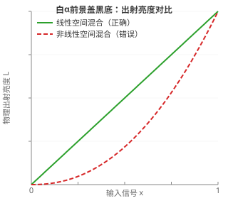

# 显示设备亮度、对比度与Alpha通道调控的物理机制与数学建模

显示设备负责把离散的数字信号转换成人眼能看见的光，是数字成像与现代显示技术之间的光电接口。用户界面上的"亮度（Brightness）"、"对比度（Contrast）"和渲染管线中的"Alpha 通道"，往往只表现为几根调节滑块。放到光度学、固体物理学和计算图像学里看，它们分别对应光辐射能量转换、模拟电路的非线性偏置、视觉系统的自适应机制，以及辐射度学合成方程。把这些参数的物理本质与数学模型讲清楚，既能解释显示失真的底层成因，也能为不同环境光照下的专业色彩再现和视疲劳控制提供量化依据。

## 光度学基础与发光物理机制

显示器件的核心任务，是把存储好的离散电信号转换成人眼能感知的电磁辐射。物理上用辐射度量来量化电磁辐射通量：辐射亮度（Radiance, Lₑ）表示单位立体角、单位投影面积上的辐射通量，单位是 W/(sr·m²)。人眼对不同波长的敏感程度并不一样。光度学引入国际照明委员会（CIE）标准人眼明视觉光谱光视效率函数 V(λ)，把客观物理量映射成与视觉感知对应的量。

光度学中的基本量是光亮度（Luminance, Lᵥ），单位为 cd/m²，其定义为：

$$L_v = K_m \int_{380\,\text{nm}}^{780\,\text{nm}} L_{e,\lambda}(\lambda) V(\lambda) d\lambda$$

式中 Kₘ ≈ 683 lm/W 是波长 λ = 555 nm 处的最大光谱光视效能常数。调节显示器亮度，物理上就是改变单位时间内屏幕发射并进入人眼瞳孔的有效感光光子通量密度。

全黑暗室里，显示设备的物理对比度（Contrast Ratio, CR）定义为全白电平下的物理亮度 L_white 与全黑电平下的物理亮度 L_black 之比：

$$\text{CR} = \frac{L_\text{white}}{L_\text{black}}$$

不同显示器件决定这一比值的物理机制并不一样。被动发光的液晶显示器（LCD）由背光模组提供恒定或局域可调的初始光通量；液晶分子层夹在两片正交偏振片之间，外加驱动电场改变双折射相位差 ΔΦ(V)，从而调制出射偏振光的振幅。出射光强度遵循电控双折射响应：

$$T(V) = T_0 \sin^2\left(2\Delta\Phi(V)\right)$$

偏振片的物理消光比有工程上限，液晶分子在锚定边界处又有排列畸变，面板本身还会散射。因此完全"关断"的液晶光阀做不到绝对零透光，总会有残余漏光（标准 IPS 面板的黑位亮度通常在 0.05～0.3 cd/m²），原生静态对比度一般就在 1000:1 到 3000:1 这个量级。

自发光器件（如 OLED 与 Micro-LED）没有背光和光阀。每个像素上的微型发光二极管在外加正向偏压下工作，注入的电子与空穴复合成激子并发光，出射光子通量与注入电流密度 J 成正比。输入信号把薄膜晶体管（TFT）推进截止区时，像素注入电流降到热激发漏电流的水平，理论出射光强无限接近于零（L_black → 0 cd/m²）。所以自发光器件在暗室里的静态对比度，数学上趋于无穷大。

## 视觉生理学机制与环境光自适应

人眼对光刺激的感知并不是线性的。显示系统必须贴合人眼的生理特性，才能在感知层面还原出自然真实的层次梯度。

韦伯-费希纳心理物理学定律指出，视网膜能分辨的最小亮度变化 ΔI，与背景刺激强度 I 保持固定比值：

$$\frac{\Delta I}{I} = k_W$$

明视觉条件下，韦伯分数 k_W 大致维持在 0.01～0.02。这说明环境或画面本身很暗时，微小的光强增量就会带来明显的感知变化；换成高光背景，则要大得多的辐射增量才能引起同等的主观视觉差异。

现代色彩科学常用史蒂文斯幂律（Stevens' Power Law）描述视觉响应：主观感知明度（Lightness, J 或 L*）与客观光强 I 之间是非线性幂函数关系：

$$\psi(I) = k \cdot I^\beta$$

暗适应环境下，明度响应指数 β ≈ 0.33～0.45（CIE L* 均匀色彩空间取立方根近似 β = 1/3）。正因如此，人眼才能在自然界跨越 10 个数量级的亮度跨度里，对阴影与暗部仍保持很高的量化判别灵敏度。

更复杂的是环境诱导野引起的横向抑制。巴特尔森-布伦曼（Bartleson-Breneman）效应给出了复杂场景下主观对比感知与视场周围环境亮度的函数关系：

$$\log B = \alpha + \beta \log L - \gamma e^{\delta \log L}$$

背景环境照度一降，视网膜进入暗适应，暗部被诱导增亮，图像阴影区的主观反差被强烈压缩。暗环绕（Dark Surround）下画面暗部容易发灰，显示系统就得抬高电光再现函数的伽马（γ），强制拉开暗部阶调；明亮环绕（Light Surround）下视觉对暗部反差更敏感，显示伽马则要向下修。

物理层面上，环境光还会直接叠到显示屏出射光上。环境照度 E_amb 在屏幕外表面产生兰伯特漫反射（Diffuse Reflection），构成一层附加的环境物理黑底（Ambient Black Floor）：

$$L_\text{refl} = \pi E_\text{amb} \cdot R_\text{diffuse}$$

这层反射光叠在屏幕自身出射光上，人眼实际接收到的有效对比度（Effective Contrast Ratio, CR_eff）会明显变差：

$$CR_\text{eff} = \frac{L_\text{white} + L_\text{refl}}{L_\text{black} + L_\text{refl}}$$

| 典型环境场景 | 环境照度 E_amb | 屏体漫反射率 R_diffuse | 反射光强 L_refl | 屏幕白位 L_white | 屏幕原生黑位 L_black | 实际有效对比度 CR_eff |
|-------------|------------------------|-------------------------------|------------------------|-------------------------|-----------------------------|-------------------------------|
| 全黑暗室 | 0 lux | 1.0% | 0.00 cd/m² | 120 cd/m² | 0.12 cd/m² (LCD) | 1000 : 1 |
| 全黑暗室 | 0 lux | 1.0% | 0.00 cd/m² | 120 cd/m² | 0.0001 cd/m² (OLED) | 1,200,000 : 1 |
| 家庭柔和照明 | 100 lux | 1.0% | 0.32 cd/m² | 120 cd/m² | 0.12 cd/m² (LCD) | 275 : 1 |
| 家庭柔和照明 | 100 lux | 1.0% | 0.32 cd/m² | 120 cd/m² | 0.0001 cd/m² (OLED) | 378 : 1 |
| 标准商业办公 | 500 lux | 1.0% | 1.59 cd/m² | 150 cd/m² | 0.15 cd/m² (LCD) | 87 : 1 |
| 标准商业办公 | 500 lux | 1.0% | 1.59 cd/m² | 150 cd/m² | 0.0001 cd/m² (OLED) | 95 : 1 |

数据很清楚：就算用上理论无限对比度的顶级自发光面板，500 lux 的普通办公光一打，屏面反射也会把有效对比度打到 100:1 以下。所以在明亮环境里必须调高显示器的发射亮度，才能在强反射背景中重新拉开物理动态范围。

## 亮度与对比度的电信号调控数学模型

显示器菜单里的叫法从 CRT 时代沿用至今，容易误导人："亮度"调的其实是暗部黑电平偏置（Offset / Bias），"对比度"调的其实是信号增益（Gain）。

电信号调控阶段，归一化到 [0, 1] 的输入信号 x 经过带硬限幅截断（Clipping）的线性变换，映射为输出驱动信号 V_out：

$$V_\text{out}(x) = \text{clamp}_{[0,1]}(g \cdot x + b) = \max(0, \min(1, g \cdot x + b))$$

式中 g 是对比度增益因子，决定输入输出曲线在中间区域的斜率；b 是亮度偏置量，决定基准黑电平在垂直方向的平移。8 位量化空间里，为了防止用户拧对比度时整体平均电平剧烈漂移，数字图像处理通常拿中性灰阶（标称值 128）当对称旋转枢轴：

$$Y = \text{clamp}_{[0,255]}\left(\lfloor g \cdot (X - 128) + 128 + b_\text{int} + 0.5 \rfloor\right)$$

参数调偏了，输入动态范围和驱动电压就会失配，出现不同形态的离散信号损失。

| 调控状态 | 传递函数解析式 | 灰度直方图变化特征 | 物理显象与画质缺陷 |
|---------|--------------|-----------------|----------------|
| 标准基准状态 (g=1, b=0) | V_out = x | 输入直方图在 [0, 255] 内无损线性保留 | 纯黑信号精准切合发光截止点，峰值信号切合饱和点 |
| 偏置过低 / 亮度偏低 (b < 0) | 当 x ≤ −b/g 时 V_out = 0 | 低灰阶数据在 0 处发生狄拉克δ式脉冲堆积 | 暗部压黑（Black Crush）：阴影纹理完全湮灭为无渐变的纯黑 |
| 偏置过高 / 亮度偏高 (b > 0) | 最小输出截断为 V_out(0) = b > 0 | 直方图底部整体右移，最低量化级悬空 | 黑位悬浮（Washed Out）：全黑背景泛灰，动态对比度遭受严重破坏 |
| 增益过高 / 对比度过大 (g > 1) | 当 x ≥ (1−b)/g 时 V_out = 1 | 高光量化值在 255 处剧烈堆叠，中间级出现梳状缺损 | 高光过曝（Highlight Clipping）：白场细节粉碎，灰阶过渡产生色带断层 |
| 增益不足 / 对比度过小 (g < 1) | 输出范围被限制在 [b, g+b] ⊂ [0,1] | 直方图向中央收缩，两侧量化区间空置 | 动态受限（Dull / Muddy）：画面灰暗扁平，无法充分激发人眼对边缘锐度的感知 |

> 上两图为矢量图（SVG），生成脚本见仓库 `scripts/gen_display_svgs.py`，可按需调整参数重新生成。

上图直观展示了"暗处没细节、高光没细节"的物理本质：**截断是把一段输入范围压平成同一个输出值**——亮度调得过低时，暗部的 16 级灰阶全部塌成纯黑（压黑）；对比度调得过高时，高光的灰阶全部顶成纯白（过曝）。被压平的层次信息在物理层面已经丢失，后期无法恢复。

现代 LCD 往往有独立背光调控，这里工程实现出现了分化。"背光（Backlight）"直接改光源的物理发光功率，电信号处理管线不动，这是真正的光子产率控制；菜单里的"对比度"和部分"亮度"滑块，则仍在面板驱动芯片（T-CON）内部对数字 LUT 做上述线性增益与偏置计算。

## 伽马校正、光电转换函数与离散编码优化

伽马校正（Gamma Correction）既有电子物理上的来历，也是一套精巧的视知觉编码优化。

CRT 的电子枪由阴极、控制栅极和加速阳极组成。按静电学与热电子发射理论中的柴尔德-朗缪尔定律（Child-Langmuir Law），在空间电荷限制区内，阴极发射进入加速电场的阳极电流 Iₐ 与控制栅极驱动电压 V_g 天然呈非线性幂函数关系：

$$I_a = k (V_g - V_\text{cutoff})^\gamma$$

电极几何构型和电场泊松方程决定了物理指数 γ 落在 2.2～2.5，CRT 荧光屏输出的光功率相对栅极电压呈超线性响应。

CRT 淘汰之后，现代数字成像并没有丢掉伽马。原因在于人眼明度感知的史蒂文斯幂指数（β ≈ 0.45）恰好与 CRT 的物理伽马（γ ≈ 2.2）近似互逆（0.45 × 2.2 ≈ 1.0）。若在物理辐射的线性空间里做 8 位（256 级）均匀量化，人眼敏感的暗部只能分到不足 10 个量化级，很容易出现阶梯状色带（Banding）；人眼迟钝的高光区却浪费了大量代码在分辨不出的细微辐射差上。

于是，在信号录制或生成端施加光电转换函数（OETF, V = L^(1/γ)），把信号映射到视觉上更均匀的感知编码空间；显示终端再用电光转换函数（EOTF, L = V^γ）解算回物理光功率。这样既贴合人眼感知，又在有限位宽下尽量提高了信息熵的传输效率。行业标准的 sRGB 传递函数还在极低灰阶引入一小段线性斜率，避免零点处一阶导数发散把模拟电路噪声放大：

$$L(C) = \begin{cases} 12.92 C, & C \le 0.04045 \\ (1.055 C + 0.055)^{2.4}, & C > 0.04045 \end{cases}$$

## Alpha 通道：辐射度学几何覆盖与渲染管线失真

二维多层图元合成与三维图形光栅化里，Alpha 通道（α）有严格的辐射传输物理学与亚像素几何学定义，不只是一个发光强度衰减系数。

微观光学辐射传输理论里，光束穿过厚度 d、吸收截面 σ 的半透明均质吸收介质时，光子通量服从比尔-朗伯定律（Beer-Lambert Law）：I = I₀e^(−σd)。透射率 T = e^(−σd)，宏观吸收不透明度定义为 α = 1 − T。数字图形学奠基人 Thomas Porter 与 Tom Duff（1984）的离散代数体系里，α ∈ [0, 1] 严格定义为像素级辐射能量覆盖的权重因子。

像素合成时，最终出射光通量 Φ_pixel 是前景与背景辐射贡献的加权和：

$$\Phi_\text{pixel} = \alpha \cdot \Phi_\text{fg} + (1 - \alpha) \cdot \Phi_\text{bg}$$

工业级渲染管线里，图像数据分直通 Alpha（Straight Alpha, (R, G, B, α)）与预乘 Alpha（Premultiplied Alpha, (αR, αG, αB, α)）两种。经典的前景覆于背景之上（Source Over）合成中，两者在计算效率与数学稳定性上差别很大：

- **直通合成**：其出射颜色为

  $$C_\text{out} = \frac{\alpha_\text{src} C_\text{src} + \alpha_\text{dst} C_\text{dst} (1 - \alpha_\text{src})}{\alpha_\text{src} + \alpha_\text{dst} (1 - \alpha_\text{src})}$$

- **预乘合成**：c_out = c_src + c_dst (1 − α_src)，α_out = α_src + α_dst (1 − α_src)

预乘 Alpha 彻底消掉了每像素计算里昂贵的除法和除零奇异点，更重要的是代数上满足结合律。三维纹理做双线性插值（Bilinear Filtering）或多级渐远纹理（Mipmap）降采样时，直通 Alpha 在颜色分量与全透明黑底（RGB=0, α=0）之间算术插值，外边缘会渗进黑色杂质；预乘 Alpha 从数学结构上根除了这种"暗边走样（Dark Artifacts）"。

图形渲染管线里最隐蔽也最具破坏性的工程错误，是在非线性伽马编码空间（比如未经解码的 sRGB 帧缓冲区）直接做 Alpha 混合。拿纯白前景（C_fg = 1.0）以半透明度 α = 0.5 盖在纯黑背景（C_bg = 0.0）上看：

在错误的非线性空间直接算，加权结果是：

$$C_\text{naive} = 0.5 \times 1.0 + 0.5 \times 0.0 = 0.5$$

这个离散值再经显示器硬件 EOTF 幂律放大出射，实际物理光通量是：

$$L_\text{actual} \approx (0.5)^{2.2} \approx 0.214\,\text{cd/m}^2$$

物理正确的线性空间合成则相反：先把输入电平用反 EOTF 解码成辐射通量，做能量守恒叠加，最后再编码：

$$L_\text{correct} = 0.5 \times (1.0)^{2.2} + 0.5 \times (0.0)^{2.2} = 0.500\,\text{cd/m}^2$$

$$C_\text{correct} = (0.500)^{1/2.2} \approx 0.735$$

两边一对比，非线性混合让像素物理出射光能损失了多达 57.2%。工程上表现为：反走样文字笔画过度收缩削瘦（Stem Thinning），高饱和互补色相交处出现脏兮兮的暗色边界，烟雾等半透明粒子渲染则扁平灰暗，呈现出非物理的聚集。

现代操作系统（如 Windows ClearType 或 FreeType 字体引擎）还把 Alpha 从标量拓展成了物理空间上的矢量。标准显示器像素由水平并排的红、绿、蓝条状子像素构成。亚像素渲染把水平采样频率提到 3 倍，光栅化阶段为 R、G、B 分别算独立的覆盖率分量：

$$\alpha = (\alpha_R, \alpha_G, \alpha_B)$$

人眼对亮度空间高频敏感、对色度空间高频比较钝。利用这一点，在物理线性空间驱动对应颜色的子像素，不增加物理像素总数，字体横向边缘的清晰度也能成倍提升。

## 传递特性响应与失真特征综合表征

下表把信号增益、偏置、伽马非线性以及 Alpha 混合错误对图像重构的联合影响放在一起看。基于标准 8 位（0–255）量化阶调，给出不同配置管线下映射到归一化物理出射亮度（L/L_max）的数值：

| 输入数字代码 X | 理想标准输出 (L/L_max) | 偏置过低 (b=−30) | 偏置过高 (b=+30) | 增益过高 (g=1.4) | 伽马过低 (γ=1.8) | 伽马过高 (γ=2.6) | 错误非线性 Alpha 混合 (α=0.5) |
|---------------|-------------------------------|-------------------|-------------------|-------------------|----------------------|----------------------|----------------------------------|
| 0 (纯黑基准) | 0.000 | 0.000 (截断) | 0.012 (黑底悬浮) | 0.000 | 0.000 | 0.000 | 0.000 |
| 16 (深暗细节) | 0.003 | 0.000 (暗部压黑) | 0.021 | 0.000 (暗部压黑) | 0.007 (阴影发白) | 0.001 (暗部深陷) | 0.003 |
| 64 (暗阴影) | 0.047 | 0.015 | 0.106 | 0.011 | 0.082 | 0.028 | 0.047 |
| 128 (中性灰) | 0.216 | 0.119 | 0.347 | 0.216 (枢轴对称) | 0.287 (中阶变亮) | 0.163 (中阶变暗) | 0.092 (能量严重凹陷) |
| 192 (明亮高光) | 0.531 | 0.395 | 0.697 | 0.672 | 0.601 | 0.468 | 0.531 |
| 235 (视频标称白) | 0.835 | 0.694 | 0.985 | 1.000 (过曝截断) | 0.866 | 0.806 | 0.835 |
| 255 (峰值白) | 1.000 | 0.860 | 1.000 (截断) | 1.000 (饱和截断) | 1.000 | 1.000 | 1.000 |

这组数据把几种核心失真的数学本质摊开了。对比度过高（增益拉伸）会把高于 235 的明亮细节直接撞在 1.000 的硬件上限上，雪地、云层等高光纹理彻底变平；亮度过低（负向偏置）让代码 16 以下全部掉进零截断区，低照度电影的暗部会压黑一块。伽马偏移维持端点不动，却强烈扭曲中间调：伽马过低，整幅画面像蒙了一层白雾；过高，中等明度的物体会失真发硬。非线性 Alpha 混合则在中性区域挖出严重的凹陷谷底，渲染过渡的平滑性被直接摧毁。

## 日常与办公环境下的专业参数推荐与人机工效学标定

视网膜光感受细胞的自适应和瞳孔直径的调节，完全受制于视野内的整体照度。脱离使用环境孤立设置显示参数，是视疲劳和色彩失真的根源。国际人机工效学标准（ISO 9241-307）与建筑室内照明标准（EN 12464-1）为不同工况定了严格的光度匹配基准。

### 场景标准推荐参数矩阵

| 调控维度 | 工业暗室与专业影视调色 (Darkroom Studio) | 居家日常与通用娱乐 (Home Entertainment) | 标准商业办公与文案处理 (Office Workstation) |
|---------|----------------------------------------|----------------------------------------|------------------------------------------|
| 工作面环境照度 | < 30 lux (极暗工作间) | 100～200 lux (环境光柔和) | 300～500 lux (国家标准推荐办公照度) |
| 目标峰值全白亮度 | 80～100 cd/m² | 120～140 cd/m² | 150～180 cd/m² |
| 白位设定物理基准 | 遵循电影工业 DCI 投影暗室标准 | 平衡动态刺激感与暗视场舒适度 | 与桌面上白纸反射光强度达成视网膜等效 |
| 目标黑电平基准 | 紧扣面板物理截止点（零光输出） | 严格匹配视频信号代码 0，杜绝浮动 | 适度压制环境杂散反光，兼顾暗部辨识度 |
| 目标伽马曲线 (EOTF) | Gamma 2.4 或 BT.1886 (补偿暗环境诱导) | Gamma 2.2 (多媒体行业标准) | Gamma 2.2 或 sRGB 曲线 (适应明亮环绕) |
| 硬件对比度 (OSD) | 锁定出厂线性标定点（禁止数字削顶） | 锁定出厂原生线性值 | 锁定出厂原生线性值 |
| 相关色温 (CCT) | 6500 K (CIE D65 标准白点) | 6500 K (夜间可开启蓝光防护至 5000K) | 6500 K (D65)（与办公照明保持色适应平衡） |
| 文本与抗锯齿渲染 | 线性空间精确透明度合成 | 操作系统标准抗锯齿调优 | 开启次像素 RGB 渲染，校正 ClearType 伽马权重 |

### 办公环境亮度推导的物理学逻辑

很多办公人员习惯把显示器亮度拧到硬件极限（350～400 cd/m²）。在 500 lux 的标准办公环境下，这会带来严重的慢性视网膜眩光刺激。按辐射物理学模型，典型办公照度 E = 500 lux 时，一张漫反射率 ρ ≈ 0.85 的白色无光泽 A4 打印纸，兰伯特漫反射亮度约为 135.3 cd/m²（L_paper = E·ρ/π ≈ 135.3）。

操作者频繁在纸质文件和电脑屏幕之间切换视线时，瞳孔括约肌不应剧烈舒张收缩。显示屏全白背景亮度宜设在 150～180 cd/m²，略高于纸质反射亮度，以弥补边框反差与自发光穿透感，维持视网膜感光细胞的生化稳态，从源头上预防视疲劳。

### 严谨的工程校准操作流程

调显示器参数时，必须按信号解耦的先后顺序来：

1. **首先**，把显示器颜色预设重置为"标准"或"自定义"，硬件对比度恢复出厂默认（通常为 50 或 70）。不要随意调大，以免显卡输出的 RGB 信号在驱动芯片内提前过冲饱和截断。

2. **其次**，调"亮度"滑块锁定物理黑电平。全屏加载标准 PLUGE 测试图（Picture Line-Up Generation Equipment，含 0% 纯黑背景和 -2%、+2%、+4% 的近黑灰阶条）。向下调亮度滑块，直到 +2% 灰阶条刚好消失，再微幅回调，让 -2% 信号条完全融进纯黑背景，而 +2% 信号条恰好勉强可辨。此时信号偏置 b 到达临界状态：既杜绝了暗部压黑，又把全黑电平锁在面板物理极限上。

3. **随后**，调"对比度"或背光亮度锚定白电平。加载高光渐变测试图（含 230 至 255 的近白灰阶块）。有独立背光调节的显示器，应通过调背光（而不是对比度）达到环境匹配的目标亮度（办公环境 150 cd/m²）；若需微调对比度滑块，要确保 253 与 254 的灰阶边界仍清晰可分，不能出现高光并阶。

4. **最后**，在操作系统里校验伽马曲线与字体 Alpha 渲染。选 2.2 标称伽马模式，运行 ClearType 文本调谐工具，比对子像素抗锯齿样例，消掉高对比度文本边界上的彩色镶边，确保排版引擎在物理线性空间内做子像素覆盖率矢量与背景光通量的加权计算。

## 结论

显示设备上的亮度、对比度与 Alpha 通道调节，是一套建立在物理学、生理感知与离散代数之上的综合调控体系，不只是主观视觉修饰工具。

- **亮度调节**做的是黑电平（偏置）校准。核心目标是让视频信号的最低有效灰阶准确落在显示设备的物理发光阈值边缘，既防止暗部压黑截断，又杜绝黑位悬浮导致的对比度塌陷。
- **对比度调节**做的是信号增益（斜率）控制。核心目标是充分利用显示面板的动态范围，同时防止信号在最高量化上限硬性溢出、过曝截断。
- **Alpha 通道合成**是辐射度学能量守恒与几何覆盖率的数学表达。混合运算必须在去伽马的物理线性空间里做，否则电光转换的非线性幂律特性会带来严重的边缘暗环与能量损失走样。
- 外界光子在屏面上的反射叠加会急剧摧毁有效物理对比度。显示参数必须与使用环境的绝对照度挂钩，以物理光度计算为锚点，才能实现精准、舒适的视觉保真。
